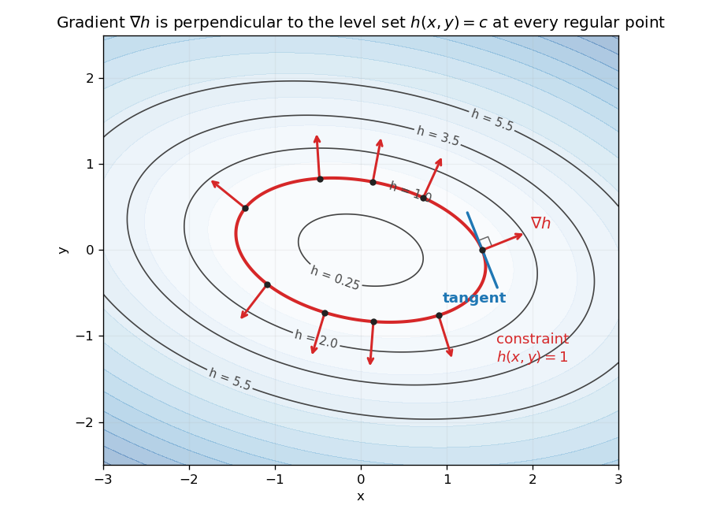
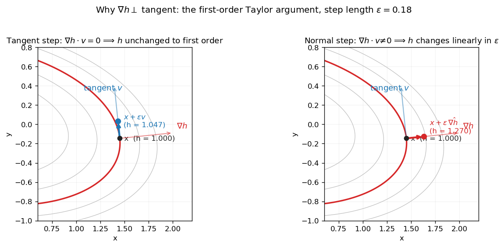
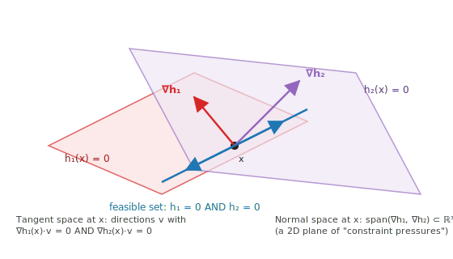

# Constraint Gradients and Tangent Spaces

## Bridges from

- **A hiker walking along a contour line on a topographic map.** Let $h(x, y)$ be elevation. A contour line is the level set $h = c$, and $\nabla h$ at any point on the map is the *direction of steepest ascent* — straight uphill, perpendicular to the contour. A hiker who wants to stay at the same elevation has to walk **perpendicular to uphill** — any step with a component along $\nabla h$ would change their elevation. So the tangent direction along any contour is exactly the direction perpendicular to $\nabla h$.

  *Where the analogy breaks down:* at a summit, saddle, or basin bottom, $\nabla h = 0$ — there is no well-defined "uphill," and the contour through that point degenerates to a single point or crosses itself. The perpendicularity statement requires a *regular point* ($\nabla h \ne 0$). And the picture is genuinely 2D-on-a-surface; in $n$ dimensions a single $\nabla h$ vector is perpendicular to a whole $(n{-}1)$-dimensional hyperplane of tangent directions, which the contour-map intuition can't quite render.

## Definition

For an equality constraint

$$
h(x)=0,
$$

the feasible set is a level set of $h$. At a regular point $x$ where $\nabla h(x)\ne 0$, the gradient $\nabla h(x)$ is normal to the tangent line, tangent plane, or tangent space of that feasible set.

The tangent directions are exactly the directions $v$ that do not change the constraint to first order:

$$
\nabla h(x)^T v = 0.
$$

So the tangent space is:

$$
T_x = \{v : \nabla h(x)^T v = 0\}.
$$

This is the core geometric fact behind [[Lagrange Multipliers]]: if a constrained optimum has no improving direction along the tangent space, then the objective gradient must also be normal to the feasible set.

### The contour-and-gradient picture

The hiker analogy made visual. Below: contour lines of $h(x,y) = \tfrac{1}{2}x^2 + \tfrac{3}{2}y^2 + 0.4\,xy$, with the level set $h = 1$ highlighted in red as "the constraint." At sample points all the way around that constraint, red gradient arrows point **outward, perpendicular to the curve**. Blue: a tangent direction plus a right-angle marker at one sample point.

The gradient always points in the *uphill* direction (toward larger $h$), and the contour is the locus where $h$ doesn't change — so gradients and contours meet at right angles wherever $\nabla h \ne 0$.

### What "perpendicular to first order" actually means

The Taylor argument above can be visualized as two side-by-side experiments at the same point $x$ on the contour $h = 1$. Step the same Euclidean distance $\epsilon = 0.18$ in two different directions:

- **Left (tangent step).** Move along $v$ with $\nabla h(x)^\top v = 0$. The endpoint sits at $h = 1.047$ — almost back on the contour. The small leftover drift is **second-order** in $\epsilon$ (the contour curves away from its tangent line). Shrink $\epsilon$ and the drift shrinks faster than the step.
- **Right (normal step).** Move along $\nabla h$ itself. The endpoint sits at $h = 1.270$ — visibly off the contour, in the higher level-set band. This change scales **linearly** with $\epsilon$: $h(x + \epsilon\,\hat{\nabla h}) \approx 1 + \epsilon\,\|\nabla h(x)\|$.

That contrast — quadratic-drift vs. linear-drift — is what "perpendicular to first order" means concretely. Tangent steps preserve the constraint up to a **vanishing correction**; any non-tangent step violates it proportionally to its component along $\nabla h$.

> Here "**vanishing correction**" means: a finite tangent-line step may not land *exactly* back on the curved constraint surface, but the leftover error becomes negligible faster than the step itself as the step size goes to zero. The tangent space describes feasible **velocities**, not necessarily exact finite displacements.
> 
> For example, take the unit-circle constraint
> 
> $$h(x,y)=x^2+y^2-1=0.$$
> 
> At $(1,0)$, the tangent direction is vertical: $v=(0,1)$. A small step of size $\epsilon$ gives
> 
> $$(1,0)+\epsilon(0,1)=(1,\epsilon).$$
> 
> But this point is not exactly on the circle:
> 
> $$h(1,\epsilon)=1+\epsilon^2-1=\epsilon^2.$$
> 
> So the constraint violation is order $\epsilon^2$, not order $\epsilon$. To project exactly back onto the circle, you would need a tiny inward correction of about $\epsilon^2/2$ in the $x$ direction. That correction is called "vanishing" because, as $\epsilon \to 0$, it shrinks much faster than the original tangent step.

## Why the gradient is normal

Two short proofs, both ending at the same equation $\nabla h(x)^\top v = 0$. They give the same geometric fact through different formalism — the Taylor version is *stepwise* (compare $h$ before and after a tiny step), and the chain-rule version is *parametric* (follow an arbitrary feasible trajectory and differentiate). Either alone is enough; together they pin down the picture.

### Argument 1: First-order Taylor expansion

Take a small feasible step from $x$ in direction $v$. A first-order Taylor expansion gives:
$$
h(x+\epsilon v)
\approx h(x)+\epsilon \nabla h(x)^T v.
$$
If $x$ is feasible, then $h(x)=0$. To remain feasible to first order, the change in $h$ must vanish:
$$
\nabla h(x)^T v = 0.
$$
That equation says every feasible tangent direction is perpendicular to $\nabla h(x)$. Therefore $\nabla h(x)$ is a normal vector to the constraint surface.

### Argument 2: Chain rule along any feasible curve

(After [[Constraint gradient perpendicular to tangent - Claude explanation]].)

Let $\gamma(t)$ be *any* smooth curve lying entirely on the constraint set, with $\gamma(0) = x$. Because every point of the curve is feasible:
$$
h(\gamma(t)) = 0 \quad \text{for all } t.
$$
The left side is a composition of $h$ with $\gamma$, so the multivariable chain rule gives:
$$
\frac{d}{dt}\, h(\gamma(t)) \;=\; \nabla h(\gamma(t))^\top \gamma'(t).
$$
The right side of the identity is the constant $0$, whose derivative is $0$. Evaluating at $t = 0$:
$$
\nabla h(x)^\top \gamma'(0) \;=\; 0.
$$
Here is the key step: since $\gamma$ was an **arbitrary** smooth curve through $x$ on the level set, its initial velocity $\gamma'(0)$ ranges over **every** tangent direction at $x$. So $\nabla h(x)$ is perpendicular to every tangent vector — equivalently, normal to the entire tangent line (or tangent plane, or tangent hyperplane in higher dimensions).

### Why both arguments agree

The Taylor argument lands on $\nabla h(x)^\top v = 0$ for one direction $v$, and you finish by saying "$v$ was arbitrary." The chain-rule argument lands on $\nabla h(x)^\top \gamma'(0) = 0$ for one curve $\gamma$, and you finish by saying "$\gamma$ was arbitrary." The two "arbitrary" steps are doing the same work: ranging over the whole tangent space. The intuition is the same in both: walking along $h = 0$ doesn't change $h$, so your direction of motion has no component along the direction $h$ changes fastest — perpendicularity in the geometric sense, or dot-product-zero in the algebraic sense.

## Dimensions

- In 2D, $h(x,y)=0$ usually forms a curve. The gradient $\nabla h(x,y)$ is perpendicular to the tangent line.
- In 3D, $h(x,y,z)=0$ usually forms a surface. The gradient $\nabla h(x,y,z)$ is perpendicular to the tangent plane.
- In $n$ dimensions, $h(x)=0$ usually forms an $(n-1)$-dimensional hypersurface. The gradient $\nabla h(x)$ spans the normal direction, and the tangent space contains all vectors orthogonal to it.

## Multiple equality constraints

For multiple equality constraints
$$
h(x)=0,\qquad h:\mathbb{R}^n\to\mathbb{R}^m,
$$
the Jacobian $J_h(x)$ stacks the constraint gradients. Tangent directions must satisfy:
$$
J_h(x)v=0.
$$
So the tangent space is the null space of the constraint Jacobian:
$$
T_x = \operatorname{null}(J_h(x)).
$$
The normal space is spanned by the rows of $J_h(x)$, equivalently by the individual constraint gradients. This is why equality-constrained stationarity has the form:
$$
\nabla f(x^\star) + J_h(x^\star)^T \lambda^\star = 0.
$$
The objective gradient is balanced by a linear combination of constraint normals.

### Two constraints in 3D: a worked schematic

When two equality constraints $h_1(x) = 0$ and $h_2(x) = 0$ meet at a regular point in $\mathbb{R}^3$, each is a surface and the feasible set is the curve where the surfaces intersect. The feasible *tangent direction* must lie in **both** surfaces' tangent planes — that is, it must be perpendicular to **both** gradients $\nabla h_1$ and $\nabla h_2$. The normal space (the space of "constraint pressures") is the plane spanned by those two gradients.

In 3D with two constraints, $\operatorname{null}(J_h)$ is 1-dimensional (the blue tangent line) and the row space of $J_h$ is 2-dimensional (the red-and-purple plane). Together they span all of $\mathbb{R}^3$ — every direction can be decomposed into "stay on the constraint set" + "violate the constraints." [[Karush-Kuhn-Tucker Conditions]] uses this decomposition: stationarity says $\nabla f$ has no component in the tangent space, equivalently $\nabla f$ lies entirely in the normal space, equivalently $\nabla f$ is a linear combination of the $\nabla h_i$ — those coefficients are the Lagrange multipliers.

## Variations / debates

This picture assumes a regular point: $\nabla h(x)\ne 0$ for one constraint, or full row rank of $J_h(x)$ for multiple independent constraints. If the constraint gradient vanishes or the constraint Jacobian loses rank, the feasible set can have [[Singularity|singularities]], and the usual tangent-plane intuition may break down.

## Connection to robotics: holonomic constraints

In [[Modern Robotics - Lynch & Park]] §2.4 (p. 28) this same picture shows up under a different name. A closed-chain robot's **loop-closure equations** $g(\theta) = 0$ are equality constraints on the joint vector $\theta \in \mathbb{R}^n$, and they reduce the [[Configuration Space]] from $\mathbb{R}^n$ to the level set of $g$ — an $(n-k)$-dimensional surface, exactly the situation this page describes.

Differentiating $g(\theta(t)) = 0$ along a trajectory gives the velocity-level form:
$$
\frac{\partial g}{\partial\theta}(\theta)\,\dot\theta = 0,
$$

i.e., feasible joint velocities $\dot\theta$ lie in the null space of the constraint Jacobian — the tangent space at $\theta$. Constraints expressible this way (as the gradient of some $g$) are called **holonomic** or **integrable** in the robotics literature.

The contrast is **nonholonomic constraints** $A(\theta)\dot\theta = 0$ where no such $g$ exists (a rolling coin is the canonical example). These give a tangent-space-like restriction on velocities at every configuration but do *not* reduce the C-space's dimension. The "test" is exactly the integrability check: try to find a function whose gradient is $A(\theta)$; if you can't, the constraint is nonholonomic.

## Related concepts

- [[Lagrange Multipliers]]
- [[Karush-Kuhn-Tucker Conditions]]
- [[Moore-Penrose Pseudoinverse]]
- [[Singularity]]
- [[Configuration Space]]
- [[Modern Robotics - Lynch & Park]]

## Sources

- [[Constraint gradient perpendicular to tangent - Claude explanation]] — AI-generated explanation contributing the chain-rule proof and the shoreline-of-a-flooded-valley framing of the contour analogy.

## Mentions

- [[Lagrange Multipliers]]
- [[Configuration Space]]
