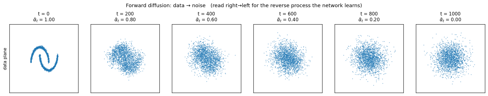
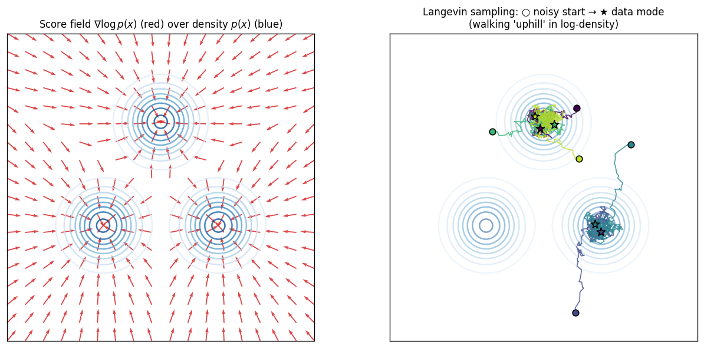

# Diffusion Models

## Explain like I'm 5

You have a beautiful photograph. Sprinkle a tiny bit of dust on it. Then a tiny bit more. Then more. After a thousand sprinkles the photo is just grey static — the picture is gone. That's the **forward process**: throw away the photo by adding noise, one little bit at a time.

Now imagine a magic eraser that, given any dusty version of the photo, can guess what it looked like *one sprinkle ago*. If you start with pure static and apply the magic eraser a thousand times, you end up with a photo — possibly a new one nobody has ever seen. That's the **reverse process**, and learning that magic eraser is what a diffusion model does.

The model never tries to leap from static to a finished photo. It only ever undoes one sprinkle of dust. That tiny step is the easy job that gets repeated.

## Bridges from

- **Sprinkling dust on a photograph and a magic eraser** *(extended)*. The dust is Gaussian noise. The "magic eraser" is a neural network that takes the noisy image plus a label saying *how dusty this version is* and outputs a guess at the dust it would need to remove. Training the eraser is just: take a real photo, add a known amount of dust, ask the network to predict that dust, score the answer with mean-squared error. Repeat for billions of examples and noise levels.

  *Where the analogy breaks down*:
  - Dust grains are particles; real diffusion noise is **continuous Gaussian** applied to every coordinate (every pixel of the image, every dimension of an action vector). You can't "remove one grain" — you remove a smooth fractional amount that depends on the timestep.
  - A real eraser undoes a known action; the diffusion network is solving an **ill-posed inverse problem** — many clean photos are consistent with a given dusty one. The network outputs an average over those possibilities, which is why a single denoising step gives a blurry guess and many sequential small steps give sharp samples.
  - The "magic eraser" is the same one for every noise level — it takes the level as input. It is not a stack of separate erasers per timestep.

## Where this sits among generative models

A generative model is anything that, after training on a dataset, can produce new samples that look like they came from the same distribution. Three families dominate:

| Family | How they generate |
|---|---|
| **GANs** | One forward pass through a generator; trained adversarially against a discriminator. Fast at inference, notoriously unstable to train. |
| **VAEs / autoregressive / normalizing flows** | Explicit probability models (likelihood-based), trained by maximum likelihood. Generally simpler to train than GANs, but sample quality historically lagged. |
| **Diffusion** | Iterative denoising. Likelihood-based (well-defined training loss = MSE between predicted and actual noise), high sample quality, slow at inference (many denoising steps). Sidesteps the [[Normalizing Constant]] problem that hobbles direct density modeling. |

Diffusion's appeal is **training stability + quality**: the loss is plain MSE on noise prediction; there is no minimax, no mode-collapse trap, no tricky normalization constant. The cost is paid at inference, where you need many (10–1000) denoising steps per sample. Most modern image generators (Stable Diffusion, Imagen, DALL·E 3) are diffusion-based; in robotics, the same recipe powers **Diffusion Policy** for action generation.

## Definition

A diffusion model defines two processes on a data distribution $p_{\text{data}}(x_0)$:

### 1. Forward process — corrupt data into noise

A Markov chain that adds Gaussian noise over $T$ timesteps:

$$
q(x_t \mid x_{t-1}) \;=\; \mathcal{N}\!\bigl(x_t;\ \sqrt{1-\beta_t}\,x_{t-1},\ \beta_t I\bigr).
$$

The variance schedule $\{\beta_t\}_{t=1}^T$ is fixed in advance, not learned, and grows slowly so each step adds only a little noise. A pleasant algebraic fact: the *cumulative* version is also Gaussian, in closed form,

$$
q(x_t \mid x_0) \;=\; \mathcal{N}\!\bigl(x_t;\ \sqrt{\bar\alpha_t}\,x_0,\ (1-\bar\alpha_t) I\bigr),
\qquad
\bar\alpha_t \;=\; \prod_{s=1}^t (1 - \beta_s).
$$

So given any clean sample $x_0$ and any timestep $t$, you can produce $x_t$ in one shot:

$$
x_t \;=\; \sqrt{\bar\alpha_t}\,x_0 \;+\; \sqrt{1-\bar\alpha_t}\,\epsilon, \qquad \epsilon \sim \mathcal{N}(0, I).
$$

$\bar\alpha_t$ starts near $1$ (clean) and decays to near $0$ (pure noise) — see the forward-process figure below.

### 2. Reverse process — learn to undo each step

The reverse transitions $p_\theta(x_{t-1} \mid x_t)$ are **not** known in closed form, but if $\beta_t$ is small they are well-approximated by another Gaussian with a learned mean. The clean derivation (Ho et al. 2020) reduces the problem to having a network $\epsilon_\theta(x_t, t)$ predict the noise that was added:

$$
\boxed{\;\mathcal{L}_{\text{simple}}(\theta) \;=\; \mathbb{E}_{x_0,\,t,\,\epsilon}\Bigl[\;\bigl\|\,\epsilon - \epsilon_\theta\!\bigl(\sqrt{\bar\alpha_t}\,x_0 + \sqrt{1-\bar\alpha_t}\,\epsilon,\ t\bigr)\bigr\|^2\,\Bigr]\;}
$$

That is the entire loss. Pick a clean datapoint, pick a random timestep, pick a random Gaussian noise vector, blend them by the formula above, ask the network to predict the noise. Score with MSE. Done.

### 3. Sampling — start from noise, denoise repeatedly

Once trained, draw $x_T \sim \mathcal{N}(0, I)$ and iterate from $t = T$ down to $t = 1$:

$$
x_{t-1} \;=\; \frac{1}{\sqrt{1-\beta_t}}\!\left(x_t \;-\; \frac{\beta_t}{\sqrt{1-\bar\alpha_t}}\,\epsilon_\theta(x_t, t)\right) \;+\; \sigma_t z, \qquad z \sim \mathcal{N}(0, I).
$$

Each step nudges $x_t$ slightly in the direction the network thinks "away from noise, toward data," then re-injects a small amount of fresh noise to keep the chain stochastic (so different starting noise yields different samples). $\sigma_t$ is a schedule constant. After $T$ steps you have $x_0$, a sample from the learned distribution.

> [!note] Why three formulas not one
> Forward kernel $q(x_t \mid x_0)$ tells you **how to make training inputs**. The loss tells you **what the network learns**. The sampling formula tells you **how to generate**. They are tied together by Bayes' rule + Gaussian algebra — but you can use the model without ever working out that derivation. Treat the boxed loss as the ground truth.

## Forward process, visualized

Read **left → right** as training data being progressively corrupted into noise. Read **right → left** as the job the network learns: given a blob at timestep $t$, hallucinate the slightly-less-noisy blob at $t-1$. The moons emerge from static one tiny denoising step at a time.

## The score interpretation (the unlock)

Predicting noise is mathematically equivalent to learning the **score function** of the noisy data distribution:

$$
\nabla_{x_t} \log p(x_t) \;\approx\; -\frac{1}{\sqrt{1 - \bar\alpha_t}}\,\epsilon_\theta(x_t, t).
$$

The score is a **gradient field over the data space** — at every point $x$, it returns the vector that points "uphill in log-density," i.e., toward higher-probability regions. This is the same mental object as a [[Constraint Gradients and Tangent Spaces|constraint gradient]] $\nabla h(x)$, just pointing to a different target:

| | $\nabla h(x)$ from optimization | $\nabla \log p(x)$ from diffusion |
|---|---|---|
| What it is | gradient of a scalar constraint | gradient of log data density |
| Geometric meaning | points perpendicular to the constraint surface $h(x)=0$ | points toward nearby data |
| Used for | projecting onto / off of feasibility | walking from noise into the data manifold |

The left panel: blue contours are the density of a three-mode mixture; red arrows are the score field. Notice every arrow points toward the nearest mode — that is what "uphill in log-density" looks like geometrically. The right panel: starting from noisy initial points (○), Langevin dynamics

$$
x_{k+1} \;=\; x_k + \eta\,\nabla \log p(x_k) + \sqrt{2\eta}\,z, \qquad z \sim \mathcal{N}(0, I)
$$

walks the trajectories into the modes (★). Diffusion sampling is a fancier version of exactly this: walk along a learned score field, with a noise-level schedule that anneals from "very noisy" down to "almost clean."

This score view is the reason diffusion is **compositional**, which is the unlock for [[Compositional Diffusion Constraint Solvers]]:

> If $p(x) \propto p_1(x)\,p_2(x)\,\cdots\,p_K(x)$ (a product of independently-trained constraint distributions), then
>
> $$\nabla \log p(x) \;=\; \nabla \log p_1(x) + \nabla \log p_2(x) + \cdots + \nabla \log p_K(x).$$

Scores **add**. You can train one diffusion model per spatial relation (`left_of`, `near`, `aligned`, …), then at inference sum their predicted scores to sample arrangements that satisfy all of them at once — no joint retraining. The boxed identity is the entire mathematical reason CDCS works.

## Conditioning: how you steer a diffusion model

Plain diffusion samples from $p(x_0)$. For anything useful you want $p(x_0 \mid c)$, where $c$ is text, an image, a robot observation, etc. Two standard mechanisms:

- **Conditional training.** Feed $c$ into the denoising network: $\epsilon_\theta(x_t, t, c)$. The loss is unchanged; the network just learns noise prediction *conditioned on* $c$.
- **Classifier-free guidance.** Train the network on both conditioned and unconditioned pairs (randomly drop $c$ during training). At inference, blend the two predictions:
  $$
  \tilde\epsilon \;=\; (1+w)\,\epsilon_\theta(x_t, t, c) \;-\; w\,\epsilon_\theta(x_t, t, \emptyset).
  $$
  The guidance scale $w \ge 0$ pushes samples further toward the conditioning at the cost of diversity. This is what makes text-to-image models sharp and "on-prompt."

In Diffusion Policy, $c$ is a stack of recent observations (images + proprioception); $x_0$ is a short action chunk. The trick is exactly the conditional-training one.

## Practical knobs you'll see in code

| Knob | What it controls | Common choices |
|---|---|---|
| **Variance schedule** $\{\beta_t\}$ | how fast noise is injected; controls signal-to-noise at each $t$ | linear, cosine (Nichol & Dhariwal); cosine for natural data |
| **Number of timesteps** $T$ | granularity of corruption | 1000 (DDPM); much less for distilled / DDIM samplers |
| **Sampler** | how you discretize the reverse SDE/ODE | DDPM (stochastic), DDIM (deterministic, fewer steps), DPM-Solver |
| **Parameterization** | what the network predicts | $\epsilon$-prediction (most common), $x_0$-prediction, $v$-prediction |
| **Architecture** | the denoising network | U-Net (images), transformer (sequences, e.g. Diffusion Policy), DiT (images, transformer) |
| **Guidance scale** $w$ | strength of conditioning | 1.5–7.5 for text-to-image; smaller in robotics |

For Diffusion Policy specifically, the typical configuration is: U-Net (1D conv variant operating on the action-chunk axis) or transformer; $T$ small (≈ 100) with DDIM at inference (≈ 10 steps); $\epsilon$-prediction; observation embedding as conditioning.

## Why diffusion ended up beating GANs and VAEs

1. **Training is just MSE.** No adversarial game, no Jensen-divergence cleverness, no KL annealing. Hyperparameters are forgiving.
2. **Likelihood is tractable** (via the variational bound) — diffusion is a principled probabilistic model, not just a sample generator.
3. **The objective is local in time.** Each denoising step is a small, well-conditioned regression. The model never has to map noise → full image in one shot, the way a GAN's generator does.
4. **Modes get covered.** GANs are infamous for mode collapse. Diffusion's noise-injecting forward process explicitly spreads probability mass everywhere, so the reverse process has to learn to land in *all* modes — exactly what you want for a multimodal action distribution in robotics.

That last point is why Diffusion Policy beats deterministic regression baselines on tasks where multiple valid actions exist: pick-the-cup-from-the-left vs. pick-from-the-right are both correct, and an L2-trained MLP would average them and miss the cup entirely.

## In imitation learning and robot policy learning

- **[[Diffusion Policy]]** (Chi et al. 2023) — applies the recipe above with $x_0$ = a short *action chunk* (e.g., next 16 actions) and $c$ = recent observations. Significantly outperforms [[Action Chunking Transformer]] on many manipulation benchmarks, especially multimodal tasks; cost is slower inference (a denoising loop per action chunk). Sets the dominant action-representation baseline in modern IL.
- **[[Compositional Diffusion Constraint Solvers]]** — trains a separate diffusion model per spatial relation, then composes their scores at inference. Score additivity is the entire reason this works; see SetItUp in [[Integrated Learning and Planning - Mao]].
- **3D scene generation / motion planning** — diffusion is being applied to trajectory generation, configuration-space sampling, and grasp generation. The common pattern: replace "sample from a complicated multimodal distribution" with "denoise from Gaussian noise toward the learned mode structure."

A reasonable mental shortcut: **anywhere a robotics paper says "sample from a learned distribution over X," in 2026 the default modeling choice is diffusion on X.** X can be images, actions, trajectories, object poses, scene graphs — the recipe transfers.

## Common confusions

- **"Diffusion" vs. "denoising autoencoder."** A denoising autoencoder learns to remove noise at *one* fixed noise level. A diffusion model learns to remove noise at *all* noise levels (timestep $t$ is a model input). That generalization is what enables sampling from pure noise.
- **"Noise prediction" vs. "data prediction."** $\epsilon$-parameterization is most common; $x_0$-parameterization predicts the clean signal directly. They are algebraically interconvertible via $x_0 = (x_t - \sqrt{1-\bar\alpha_t}\,\epsilon)/\sqrt{\bar\alpha_t}$. $v$-parameterization mixes the two and is more stable at extreme timesteps.
- **"DDPM" vs. "score-based SDE" vs. "diffusion."** DDPM is the discrete-time formulation (Ho et al. 2020). Score-based SDEs (Song et al. 2021) are the continuous-time view: forward is an SDE, reverse is a learned reverse-SDE, and the score function is what you learn. They converge to the same algorithms; "diffusion model" is the umbrella term. Yang Song's framing ([[Generative Modeling by Estimating Gradients of the Data Distribution - Yang Song]]) is that the two are *"different perspectives of the same model family, like wave mechanics and matrix mechanics in quantum mechanics"* — the ELBO Ho derives is the same weighted Fisher divergence the score-matching view writes down. If a paper says "noise predictor $\epsilon_\theta$" or "score network $s_\theta$," they are the same network up to the scalar $-1/\sqrt{1-\bar\alpha_t}$.
- **"Latent diffusion."** Stable Diffusion and friends run the diffusion process not on pixels but on a VAE-compressed latent. This is an efficiency trick (smaller tensors, faster inference); the math is unchanged. Robotics policies usually run diffusion directly on raw action chunks because they're low-dimensional already.

## Origins / sources

Primary papers:

- **Sohl-Dickstein et al. 2015**, *Deep Unsupervised Learning using Nonequilibrium Thermodynamics* — original idea.
- **Ho, Jain, Abbeel 2020**, *Denoising Diffusion Probabilistic Models (DDPM)* — the clean modern formulation, MSE noise-prediction loss.
- **Song & Ermon 2019** + **Song et al. 2021** — score-matching view; SDE/ODE formulation.
- **Nichol & Dhariwal 2021** — improved schedules (cosine), classifier guidance.
- **Ho & Salimans 2022** — classifier-free guidance.
- **Salimans & Ho 2022**, *Progressive Distillation* — halving sampling steps per iteration.
- **Song et al. 2023**, *Consistency Models* — single-step generation via the consistency function.
- **Rombach et al. 2022**, *Latent Diffusion (LDM)* — diffusion on VAE latents; Stable Diffusion's architecture.
- **Peebles & Xie 2023**, *DiT* — transformer backbone for diffusion (the modern scale-up choice).
- **Chi et al. 2023**, *Diffusion Policy: Visuomotor Policy Learning via Action Diffusion* — the robotics adaptation that matters here.

(External links — paper PDFs not in `raw/assets/papers/` yet; queued under `[[Diffusion Policy]]` deep-read.)

Canonical secondary surveys (both ingested into this vault, both worth reading end-to-end):

- [[What are Diffusion Models - Lilian Weng]] — DDPM-first treatment: forward kernel → ELBO → ε-loss → guidance → DDIM → distillation → consistency models → LDM → unCLIP / Imagen → U-Net / ControlNet / DiT. The reference for "what equation does the network actually optimize."
- [[Generative Modeling by Estimating Gradients of the Data Distribution - Yang Song]] — score-first treatment: score function → Langevin → NCSN → annealed Langevin → SDE generalization (VE / VP / sub-VP) → probability-flow ODE for exact likelihoods → Bayes-on-scores for inverse problems. The reference for "why is the score the right thing to model" and the unification with DDPM.

## Socratic check

> [!question] Three to test the recipe
> 1. **The noise-level input.** Why does the denoising network $\epsilon_\theta(x_t, t)$ take $t$ as an explicit input? What would go wrong if you trained one network per timestep, or one network that ignored $t$ entirely?
> 2. **From noise prediction to score.** Suppose at some $(x_t, t)$ the network outputs $\epsilon_\theta(x_t, t) = 0$. What does the *score interpretation* say about that point — geometrically, where is $x_t$ relative to the data distribution? What happens to the next sampling step?
> 3. **Why composition works.** [[Compositional Diffusion Constraint Solvers]] adds together scores from independently-trained constraint diffusion models. Translate the score-additivity identity $\nabla \log(\prod_k p_k) = \sum_k \nabla \log p_k$ into a statement about *probabilities* — and explain why that statement would **not** be true if you tried to compose the predicted noises of two GAN generators by averaging their outputs.

## Related concepts

- [[Compositional Diffusion Constraint Solvers]] — exploits score additivity directly.
- [[Constraint Gradients and Tangent Spaces]] — same gradient-field mental model, different target.
- [[Normalizing Constant]] — the $Z_\theta$ that score-based / diffusion training avoids. Why "noise predictor" parameterizations exist at all.
- [[Action Chunking Transformer]] — the regression baseline Diffusion Policy displaces on multimodal tasks.
- [[Imitation Learning]] — the broader algorithmic context.
- (red link) [[Diffusion Policy]] — application to robot action generation; the next deep-read.
- (red link) [[Score Matching]] — the theoretical sibling of DDPM.
- (red link) [[Classifier-Free Guidance]] — standard conditioning trick.
- [[Sigmoid Function]] — unrelated, but a useful reminder that classical activations rarely appear inside diffusion U-Nets; modern denoisers use SiLU / GELU.

## Mentions

- [[What are Diffusion Models - Lilian Weng]] — ingested 2026-05-30; canonical secondary source for the DDPM-first derivation.
- [[Generative Modeling by Estimating Gradients of the Data Distribution - Yang Song]] — ingested 2026-05-30; canonical secondary source for the score-based / SDE-first derivation.
- (still queued: inbound from [[Diffusion Policy]] and [[Compositional Diffusion Constraint Solvers]] on the next pass)
