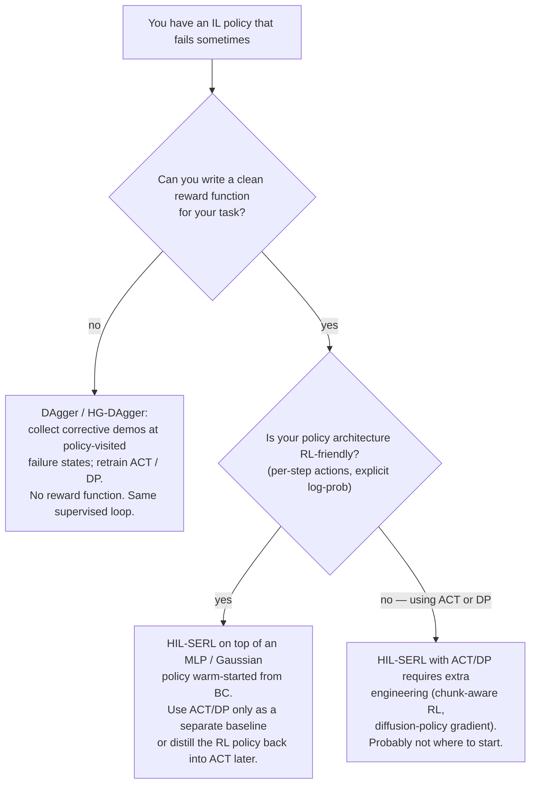

# Imitation Learning

## Definition

Imitation learning trains a robot policy from demonstrations. In the common behavioral cloning setup, the model sees observations from a task and learns to predict the expert action that was taken.

For a self-researcher, imitation learning is usually the first practical robot-learning method because it replaces reward design with teleoperated examples: record yourself doing the task, train a policy, evaluate, collect more data around failures, and repeat.

## Origins / sources

- LeRobot's real-world tutorial centers on recording and visualizing a dataset, training a policy, and evaluating the result on a robot.
- [[Action Chunking Transformer|ACT]], short for Action Chunking with Transformers, is presented in the LeRobot docs as a beginner-friendly imitation-learning policy with fast training and relatively low compute needs.
- [[Learning Fine-Grained Bimanual Manipulation with Low-Cost Hardware - Zhao et al]] introduced ACT for fine-grained bimanual manipulation and frames action chunking as a way to reduce compounding error in behavioral cloning.
- Human-in-the-loop workflows can improve a policy by recording interventions when the autonomous policy starts failing — covered in detail in [§ Correcting an IL policy with human interventions](#correcting-an-il-policy-with-human-interventions) below.

## Variations / debates

- Pure behavioral cloning is simple but can accumulate errors when the robot drifts into states absent from the demonstrations.
- [[Action Chunking Transformer|Action chunking]] predicts a short sequence of future actions instead of a single next action, which can make behavior smoother and easier to deploy at control rate.
- Diffusion and VLA policies can handle richer multimodal action distributions but usually need more compute and more careful inference engineering.

## Correcting an IL policy with human interventions

A trained IL policy will eventually fail somewhere — typically because it has drifted into states the demonstrations never covered (the *distribution-shift* failure mode of behavioral cloning). There are exactly two ways to fix this, and they correspond to two distinct workflows.

### Flavor 1 — DAgger-style: stay in IL, just add corrective demos

> *Driving-school analogy:* an instructor watches you drive and briefly grabs the wheel when you're about to make a mistake. You note what they did and re-read those notes later. You never need a "score" for driving — the instructor's actions *are* the lesson.

**Pattern:**

1. Train ACT / Diffusion Policy on initial teleop demos.
2. Roll out the trained policy in sim or on the real robot.
3. At states $s$ where the policy is about to fail, a human takes over and demonstrates the correct action $a^\star$.
4. Append the new $(s, a^\star)$ pair to the dataset.
5. Retrain the same supervised loss on the enlarged dataset. Repeat.

This is the **DAgger** family (*Dataset Aggregation*, Ross et al. 2011) and its human-gated variant **HG-DAgger** (Kelly et al. 2019). No reward function. No RL machinery. Training stays a vanilla PyTorch supervised loop. The corrections directly fix distribution shift because the dataset now covers *the policy's own visited states*, not just the teacher's.

This is the **cheapest and most natural** way to combine human corrections with ACT / DP — the architecture, the loss, and the training loop are unchanged.

### Flavor 2 — HIL-SERL-style: switch paradigms, use RL to fine-tune

> *Shoulder-tap analogy:* the instructor now gives you both example moves *and* a scoring rule ("did the cube land in the box?"). You learn from both the score and the instructor's grabs.

**Pattern:**

1. Pretrain a policy on demonstrations.
2. Switch to **reinforcement learning** with a defined reward function (e.g. success bit when cube lifted).
3. During RL rollouts, the human can intervene; corrections enter the replay buffer with high learning weight.
4. The RL algorithm updates the policy using both reward gradients and the intervention data.

This is what the HIL-SERL paper does — RL fine-tuning with online human corrections, built on SERL / RLPD (Reinforcement Learning with Prior Data; Ball et al. 2023). The starting policy can be IL-pretrained. See the LeRobot tutorial that wraps this for sim training at [[Training Environments and the Gymnasium API#Concrete example: gym_hil]].

The cost: you now need a reward function (often where the practical appeal of IL evaporates for hard manipulation), and the RL machinery is heavier — actor/learner servers, replay buffers, off-policy stability tricks. The upside is the policy can in principle *exceed* the teacher's performance, because RL optimizes the scoring rule rather than mimicking.

### Friction: ACT and Diffusion Policy don't slot cleanly into RL fine-tuning

If you imagine "I'll train ACT, then drop it into HIL-SERL as the policy network" — that's **not turn-key**. Two architectural quirks fight RL fine-tuning:

| Quirk | Why it's awkward for RL |
|---|---|
| **ACT predicts action chunks** $(a_t, \ldots, a_{t+k})$ | RL typically wants per-step actions and per-step rewards. Either treat the chunk as one big multi-dim action (loses temporal credit assignment), or unroll the chunk and re-query (loses chunking benefit), or use a method that natively handles temporal abstraction. |
| **Diffusion Policy samples actions via iterative denoising** | Action distribution is implicit (no clean log-probability), so PPO / SAC don't slot in cleanly. There is recent work on flow / diffusion-policy RL (DPPO, Consistency PG) but the toolchain is less mature than for standard MLPs. |

The DAgger flavor has **no such friction with ACT/DP** — corrections are just more dataset entries, and the training loop is unchanged.

### Decision flow

### The deeper insight

Distribution shift is the **core failure mode** of imitation learning, and there are exactly two ways to fix it:

1. **Expand the demonstrated distribution** until it covers the states the policy visits. *DAgger does this.*
2. **Add a different supervisory signal** (reward) that gives feedback on states the demonstrations didn't cover. *HIL-SERL does this.*

Choosing between them depends on whether writing a reward function is feasible. For fine manipulation it usually isn't, so practical teleop-trained pipelines (LeRobot, LeIsaac, most production demo flywheels) gravitate toward **(1)**. HIL-SERL is more popular in research than in production for exactly this reason — the reward-engineering cost rarely pays back when demos are cheap.

For the [[VR Teleoperation in Simulation|LeIsaac onramp]] specifically: when an ACT policy starts missing the cube, the highest-leverage move is **5–20 more corrective teleop episodes from the failure states**, not standing up an RL fine-tuning pipeline. That keeps you in pure IL where ACT lives natively.

## Related concepts

- [[Robot Learning]]
- [[Action Chunking Transformer]]
- [[Vision-Language-Action Models]]
- [[Robotics Development Stack]]

## Mentions

- [[LeRobot]]
- [[LeRobot Documentation Index]]
- [[Modern Robotics Development - synthesis]]
- [[Learning Fine-Grained Bimanual Manipulation with Low-Cost Hardware - Zhao et al]]

## External sources

- LeRobot imitation-learning docs: https://huggingface.co/docs/lerobot/main/il_robots
- LeRobot ACT docs: https://huggingface.co/docs/lerobot/act
- Robot Learning tutorial paper: https://arxiv.org/abs/2510.12403
- Ross et al., *A Reduction of Imitation Learning and Structured Prediction to No-Regret Online Learning* (DAgger), AISTATS 2011: https://arxiv.org/abs/1011.0686
- Kelly et al., *HG-DAgger: Interactive Imitation Learning with Human Experts*, ICRA 2019: https://arxiv.org/abs/1810.02890
- Luo et al., *Precise and Dexterous Robotic Manipulation via Human-in-the-Loop Reinforcement Learning* (HIL-SERL), arXiv:2410.21845, 2024: https://arxiv.org/abs/2410.21845
- Ball et al., *Efficient Online Reinforcement Learning with Offline Data* (RLPD), ICML 2023: https://arxiv.org/abs/2302.02948
