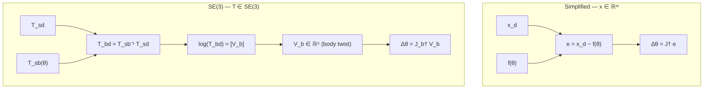

# Numerical Inverse Kinematics

> Newton-Raphson on a Lie group. The matrix logarithm is what lets you treat "the gap between two poses" as a 6-vector that an inverse Jacobian can consume.

## Explain like I'm 5

You're standing somewhere on a globe; your friend is somewhere else. Subtracting their latitude/longitude from yours is not a useful "how to walk there" instruction — near the poles those numbers lie about distances and directions. What you actually want is **a little arrow on the ground at your feet** that says "head this way, this far."

The procedure that turns a *point on the globe* into an *arrow at your feet* is called a **logarithm map**.

A robot end-effector pose is the same kind of object, just in a bigger space. You can't subtract two poses to get the "error." You ask for the arrow at your feet — except now the arrow is a **6-vector** (3 for which axis to spin around + 3 for the linear motion along it), and the procedure that produces it is the **matrix logarithm on SE(3)**. That 6-vector is the **body twist** $\mathcal{V}_b$.

Once the error is a vector, the rest of Newton-Raphson goes through unchanged.

## Bridges from

- **Globe / great-circle direction**: walking from one point on a sphere to another isn't done by subtracting coordinates — you read off a tangent arrow at your current location. *Logarithm map.* Breaks down because SE(3)'s tangent vector packages **rotation + translation together** as a screw motion (a wood screw going into a board: spin + slide along one axis), not just a direction. Also: just as antipodes on a sphere have ambiguous great circles, SE(3)'s log is ambiguous near $\pi$-rotations.
- **Newton's method in 1D**: $x^{i+1} = x^i - f(x^i)/f'(x^i)$. The Jacobian version is the multivariate generalization; the SE(3) version is the manifold generalization of the multivariate version. *Same skeleton, different "error" object each layer up.*

## The problem

Given a desired end-effector pose $T_{sd} \in SE(3)$ and the forward kinematics map $T_{sb}(\theta)$ from joint angles to EE pose, find $\theta$ such that $T_{sb}(\theta) = T_{sd}$.

Closed-form (analytic) IK exists only for special manipulator structures (Ch. 6.1). The general workhorse is **numerical IK** — start with a guess $\theta^0$, iteratively correct.

## The simplified version (vector coordinates)

Suppose the task is described by a coordinate vector $x_d \in \mathbb{R}^m$ — e.g. $(p_x, p_y, p_z, \text{ZYX Euler angles})$ — and forward kinematics is $f: \mathbb{R}^n \to \mathbb{R}^m$. Newton-Raphson around the current guess:

$$
x_d = f(\theta^i) + J(\theta^i)\,\Delta\theta + O(\|\Delta\theta\|^2)
$$

Drop the higher-order terms, solve for $\Delta\theta$:

$$
\Delta\theta = J^\dagger(\theta^i)\,\bigl(x_d - f(\theta^i)\bigr), \qquad \theta^{i+1} = \theta^i + \Delta\theta
$$

The pseudoinverse $J^\dagger$ (see [[Moore-Penrose Pseudoinverse]]) handles non-square Jacobians: minimum-norm solution if $n > m$ (redundant), least-squares if $n < m$ (over-constrained), regular inverse if $n = m$.

**Key observation**: the error $e = x_d - f(\theta^i)$ is a **vector in $\mathbb{R}^m$**. The pseudoinverse only knows how to consume vectors. That's the load-bearing assumption.

## The SE(3) version — what breaks

When the task is a pose $T_{sd} \in SE(3)$, not a coordinate vector:

- $T_{sd}$ and $T_{sb}(\theta^i)$ are both $4\times 4$ homogeneous transformation matrices.
- You can write $T_{sd} - T_{sb}(\theta^i)$, but the result is *not* a meaningful "error" — SE(3) isn't a vector space. Element-wise subtraction throws away the constraint that the rotation block must be in $SO(3)$.
- Even if you tried to compose this with a Jacobian, the units and frames wouldn't match.

You need a way to express "the gap between current and desired pose" as a **6-vector** (because $SE(3)$ is 6-dimensional). The matrix logarithm is that way.

## The fix — matrix log gives you the body twist

**Step 1**: form the pose gap in the body frame.
$$
T_{bd} = T_{sb}^{-1}(\theta^i)\, T_{sd}
$$
This is "the transformation, expressed in my current body frame, that would take me from where I am to where I want to be." Still a 4×4 in $SE(3)$.

**Step 2**: extract the screw motion that realizes that gap in unit time.
$$
\bigl[\mathcal{V}_b\bigr] = \log\bigl(T_{bd}\bigr)
$$

A few words on what's happening here:

- $\log(\cdot)$ is the **matrix logarithm on $SE(3)$** — the inverse of the matrix exponential that Ch. 3 uses to define screw motions ($e^{[\mathcal{V}]\theta}$).
- The output $[\mathcal{V}_b]$ is a $4\times 4$ matrix in the Lie algebra $\mathfrak{se}(3)$, but it is parameterized by **only 6 numbers** — call them $(\omega_b, v_b) \in \mathbb{R}^6$, the angular and linear components of the **body twist** $\mathcal{V}_b$.
- The bracket $[\cdot]$ is the "hat" operator that packs the 6 numbers back into the $4\times 4$ Lie-algebra form. The thing you actually use downstream is the 6-vector $\mathcal{V}_b \in \mathbb{R}^6$.
- Interpretation: $\mathcal{V}_b$ is the **constant body twist** that, if applied for one unit of time, would slide your EE along a screw path from current pose to desired pose. By Chasles' theorem, every rigid-body displacement *can* be realized by exactly one such screw — so this representation is well-defined (modulo the $\pi$-rotation ambiguity).

This 6-vector is your error vector. It lives in a vector space (the Lie algebra $\mathfrak{se}(3) \cong \mathbb{R}^6$), so Newton-Raphson goes through.

## Why **body** twist, not space twist

Because the **body Jacobian** $J_b(\theta) \in \mathbb{R}^{6\times n}$ satisfies
$$
\mathcal{V}_b = J_b(\theta)\, \dot\theta
$$
i.e. joint rates map to *body* twists. So when you invert,
$$
\Delta\theta \;\approx\; J_b^\dagger(\theta)\, \mathcal{V}_b
$$
the frames match. If you used a space twist $\mathcal{V}_s$ here, you'd have to pair it with the space Jacobian $J_s$ instead. Both versions are valid; Modern Robotics presents the body version because $\log(T_{sb}^{-1}T_{sd})$ naturally lands in the body frame.

The two are related by the adjoint map:
$$
\mathcal{V}_s = \mathrm{Ad}_{T_{sb}}\,\mathcal{V}_b, \qquad J_s = \mathrm{Ad}_{T_{sb}}\,J_b
$$
(Ch. 5 territory.)

## The full update equation

$$
\boxed{\;\theta^{i+1} = \theta^i + J_b^\dagger(\theta^i)\; \log\!\bigl(T_{sb}^{-1}(\theta^i)\, T_{sd}\bigr)\;}
$$

Iterate until $\|\mathcal{V}_b\|$ falls below a tolerance (typically split into angular tolerance $\|\omega_b\| < \epsilon_\omega$ and linear tolerance $\|v_b\| < \epsilon_v$, because they have different units).

## Side-by-side flow

The skeleton is identical; only **"form the error"** changes. The change is structural: when the task space is a manifold rather than a vector space, you need a logarithm map to produce a tangent-space error.

## Visualization: log map on a sphere (the analogy)

<svg viewBox="0 0 480 320" xmlns="http://www.w3.org/2000/svg">
  <defs>
    <marker id="arrow-numik" viewBox="0 0 10 10" refX="9" refY="5" markerWidth="7" markerHeight="7" orient="auto">
      <polygon points="0 0, 10 5, 0 10" fill="#ff7f0e"/>
    </marker>
    <marker id="arrow-green" viewBox="0 0 10 10" refX="9" refY="5" markerWidth="6" markerHeight="6" orient="auto">
      <polygon points="0 0, 10 5, 0 10" fill="#2ca02c"/>
    </marker>
  </defs>
  <ellipse cx="240" cy="160" rx="140" ry="100" fill="#fafafa" stroke="#333" stroke-width="1.5"/>
  <ellipse cx="240" cy="160" rx="140" ry="22" fill="none" stroke="#bbb" stroke-dasharray="3,3"/>
  <line x1="240" y1="60" x2="240" y2="260" stroke="#bbb" stroke-dasharray="3,3"/>
  <path d="M 175 110 Q 245 95 315 195" stroke="#2ca02c" stroke-width="2" fill="none" stroke-dasharray="5,3" marker-end="url(#arrow-green)"/>
  <text x="255" y="92" font-family="serif" font-size="13" fill="#2ca02c">great circle (geodesic)</text>
  <circle cx="175" cy="110" r="5" fill="#1f77b4"/>
  <text x="120" y="105" font-family="serif" font-size="14" fill="#1f77b4">A — current pose</text>
  <circle cx="315" cy="195" r="5" fill="#d62728"/>
  <text x="325" y="200" font-family="serif" font-size="14" fill="#d62728">B — target pose</text>
  <line x1="175" y1="110" x2="222" y2="100" stroke="#ff7f0e" stroke-width="2.5" marker-end="url(#arrow-numik)"/>
  <line x1="175" y1="110" x2="222" y2="100" stroke="#ff7f0e" stroke-width="2.5"/>
  <text x="155" y="80" font-family="serif" font-size="12" fill="#ff7f0e">tangent arrow at A</text>
  <text x="155" y="65" font-family="serif" font-size="12" fill="#ff7f0e" font-style="italic">= log_A(B)</text>
  <line x1="125" y1="135" x2="190" y2="113" stroke="#ff7f0e" stroke-width="0.5"/>
  <text x="20" y="295" font-family="serif" font-size="12" fill="#444">The sphere is curved — B − A is not a meaningful "go this way" vector.</text>
  <text x="20" y="310" font-family="serif" font-size="12" fill="#444">The log map at A returns the tangent arrow toward B. SE(3) ↔ globe; body twist ↔ tangent arrow; matrix log ↔ log map.</text>
</svg>

## When the Jacobian is near-singular

At a [[Singularity]], $J_b$ loses rank and $J_b^\dagger$ amplifies the error wildly — the update lurches. Standard fix: **damped least squares** (Levenberg-Marquardt),
$$
\Delta\theta = J_b^\top\bigl(J_b J_b^\top + \lambda^2 I\bigr)^{-1}\,\mathcal{V}_b
$$
which interpolates between Newton-Raphson ($\lambda = 0$) and gradient descent (large $\lambda$). The pseudoinverse formula is the $\lambda \to 0$ limit; DLS picks $\lambda > 0$ adaptively when the Jacobian is conditioning-poor.

## Common confusions

- **"Why not just use ZYX Euler angles to make it a vector problem?"** You can — but Euler-angle representations have their own singularities (gimbal lock), and the Jacobian relating joint rates to Euler-angle rates becomes ill-conditioned there. The SE(3)/twist formulation has the most well-behaved geometry.
- **"$\log$ of a $4\times 4$ matrix gives a $4\times 4$ matrix — where does the 6-vector come from?"** The matrix log of a $T \in SE(3)$ doesn't land just anywhere in $\mathbb{R}^{4\times 4}$ — it lands in the Lie algebra $\mathfrak{se}(3)$, which is a specific 6-dimensional subspace of $\mathbb{R}^{4\times 4}$. The hat/vee operators $[\cdot]$ and $(\cdot)^\vee$ convert between the 6-vector parameterization and the $4\times 4$ Lie-algebra form.
- **"Body or space — does the choice matter for convergence?"** Both converge in the same neighborhood. Body twist is more common because (a) the log lands there naturally, (b) the body Jacobian is constant when expressed in the EE frame (only the joint screws transform), simplifying code.
- **"This looks like gradient descent on a Lie group."** Close — it *is* Newton-Raphson on a Lie group. The connection to retraction-based optimization on manifolds is exact: $\log$ is the retraction's inverse, $\exp$ is the retraction. (See Boumal, *An Introduction to Optimization on Smooth Manifolds*, if you want the full Riemannian optimization framing later.)

## Connection to current learning thread

- The matrix log is the SE(3) analog of "tangent vector at the current point" — same role as $\nabla h(x)$ does in [[Constraint Gradients and Tangent Spaces]] (a vector in the tangent space, used to take a feasible step).
- The body Jacobian extends the linear-algebra Jacobian used in the simplified IK to the Lie-group setting. Real preliminaries live in Ch. 3 ([[Twist]], [[Exponential Coordinates of Rigid-Body Motion]]) and Ch. 5 ([[Body Jacobian]], [[Space Jacobian]]) — both of which are queued.
- For teleoperation pipelines surveyed in [[VR Teleoperation in Simulation]], a damped-least-squares variant of this iteration is what actually runs inside Isaac Lab's IK controllers (and what cuRobo accelerates on GPU).

## Origins

- Newton's method dates to 1669 (single variable); the Jacobian-based generalization is folklore by the mid-20th century.
- Whitney (1969) introduced **resolved motion rate control**, which is essentially this update applied at the velocity level for real-time control.
- The screw-theoretic / Lie-group formulation traces to Ball (1900, *A Treatise on the Theory of Screws*) for the geometry, and Brockett (1980s) for the modern $\exp$/PoE formulation used in Modern Robotics.

## Socratic check

> [!question] Three questions
> 1. **What goes wrong concretely if you tried to define the error as element-wise subtraction $T_{sd} - T_{sb}$ and feed it through a (12-row) Jacobian?** Give a specific way it would fail to behave like a Newton step.
> 2. **The matrix log of $T_{bd} \in SE(3)$ is a $4\times 4$ matrix.** Where does the 6-vector $\mathcal{V}_b \in \mathbb{R}^6$ come from? What dimension does it match, and why?
> 3. **Would space twist + space Jacobian work just as well?** If yes, what's the equivalent update equation? If no, what would break?

## Sources

- [[Modern Robotics - Lynch & Park]] §6.2.2, pp. 226–230 (printed). Background on twists/exp coords: Ch. 3 (§§3.2–3.3); body vs. space Jacobian: Ch. 5.
- [[Configuration Space]] — manifold structure that motivates the tangent-space framing.
- [[Constraint Gradients and Tangent Spaces]] — the same "vector in tangent space" mental object, from optimization.
- [[Moore-Penrose Pseudoinverse]] — what $J_b^\dagger$ is and how it behaves for non-square / rank-deficient cases.
- [[Singularity]] — what happens when $J_b$ loses rank; motivates DLS.
- Boumal, *An Introduction to Optimization on Smooth Manifolds* (open access) — Riemannian optimization framing, if you want the general theory later.
