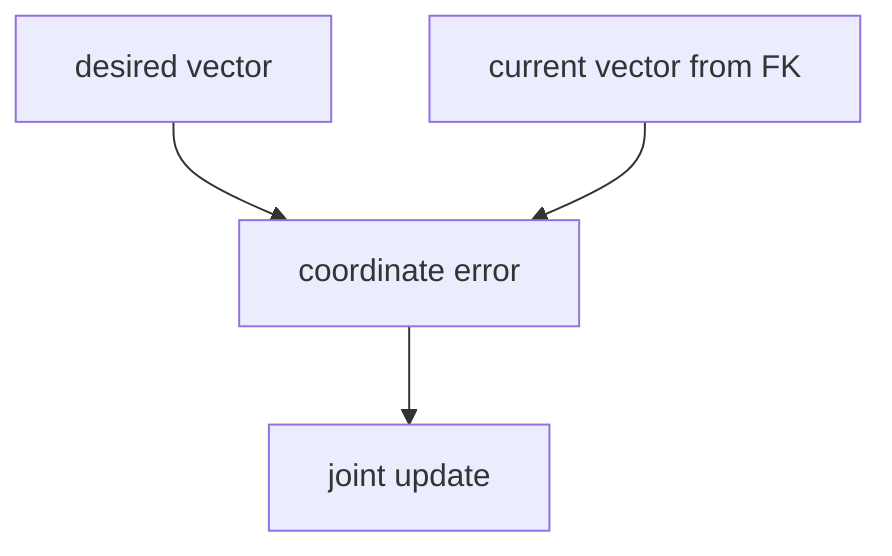
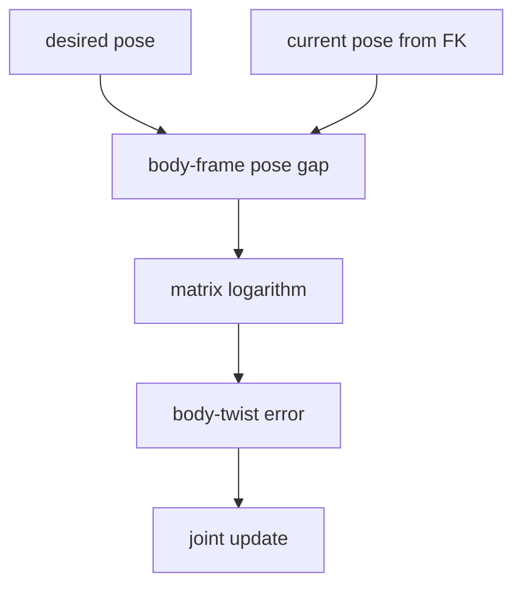
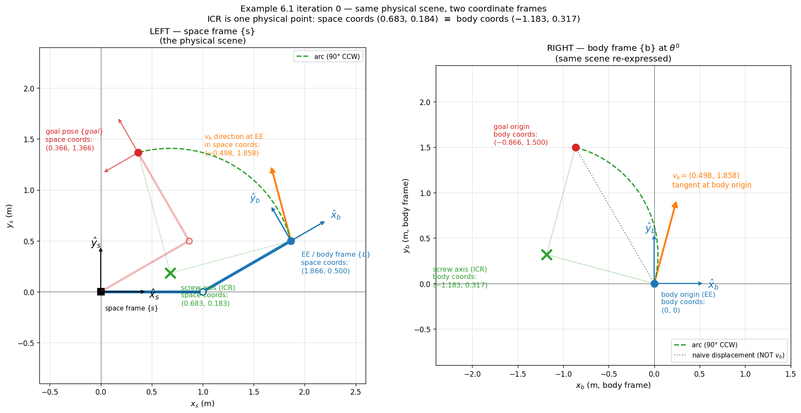
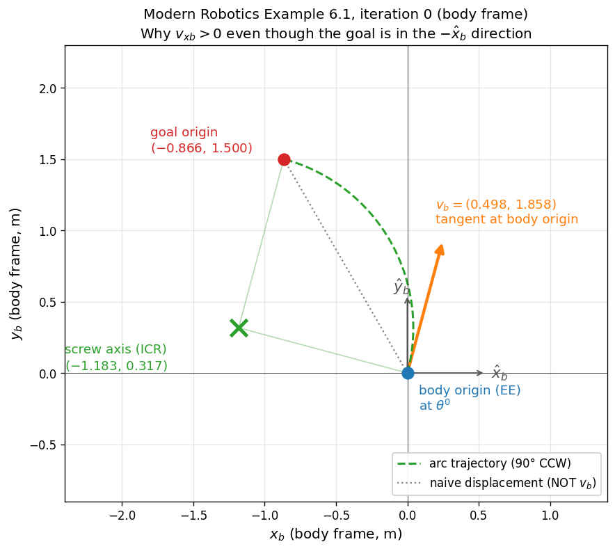

# Numerical Inverse Kinematics

> Newton-Raphson on a Lie group. The matrix logarithm is what lets you treat "the gap between two poses" as a 6-vector that an inverse Jacobian can consume.

## Explain like I'm 5

You're standing somewhere on a globe; your friend is somewhere else. Subtracting their latitude/longitude from yours is not a useful "how to walk there" instruction — near the poles those numbers lie about distances and directions. What you actually want is **a little arrow on the ground at your feet** that says "head this way, this far."

The procedure that turns a *point on the globe* into an *arrow at your feet* is called a **logarithm map**.

A robot end-effector pose is the same kind of object, just in a bigger space. You can't subtract two poses to get the "error." You ask for the arrow at your feet — except now the arrow is a **6-vector** (3 for which axis to spin around + 3 for the linear motion along it), and the procedure that produces it is the **matrix logarithm on SE(3)**. That 6-vector is the **body twist** $\mathcal{V}_b$.

Once the error is a vector, the rest of Newton-Raphson goes through unchanged.

## Bridges from

- **Globe / great-circle direction**: walking from one point on a sphere to another isn't done by subtracting coordinates — you read off a tangent arrow at your current location. *Logarithm map.* Breaks down because SE(3)'s tangent vector packages **rotation + translation together** as a screw motion (a wood screw going into a board: spin + slide along one axis), not just a direction. Also: just as antipodes on a sphere have ambiguous great circles, SE(3)'s log is ambiguous near $\pi$-rotations.
- **Newton's method in 1D**: $x^{i+1} = x^i - f(x^i)/f'(x^i)$. The Jacobian version is the multivariate generalization; the SE(3) version is the manifold generalization of the multivariate version. *Same skeleton, different "error" object each layer up.*

## The problem

Given a desired end-effector pose $T_{sd} \in SE(3)$ and the forward kinematics map $T_{sb}(\theta)$ from joint angles to EE pose, find $\theta$ such that $T_{sb}(\theta) = T_{sd}$.

Closed-form (analytic) IK exists only for special manipulator structures (Ch. 6.1). The general workhorse is **numerical IK** — start with a guess $\theta^0$, iteratively correct.

## The simplified version (vector coordinates)

Suppose the task is described by a coordinate vector $x_d \in \mathbb{R}^m$ — e.g. $(p_x, p_y, p_z, \text{ZYX Euler angles})$ — and forward kinematics is $f: \mathbb{R}^n \to \mathbb{R}^m$. Newton-Raphson around the current guess:

$$
x_d = f(\theta^i) + J(\theta^i)\,\Delta\theta + O(\|\Delta\theta\|^2)
$$

Drop the higher-order terms, solve for $\Delta\theta$:

$$
\Delta\theta = J^\dagger(\theta^i)\,\bigl(x_d - f(\theta^i)\bigr), \qquad \theta^{i+1} = \theta^i + \Delta\theta
$$

The pseudoinverse $J^\dagger$ (see [[Moore-Penrose Pseudoinverse]]) handles non-square Jacobians: minimum-norm solution if $n > m$ (redundant), least-squares if $n < m$ (over-constrained), regular inverse if $n = m$.

**Key observation**: the error $e = x_d - f(\theta^i)$ is a **vector in $\mathbb{R}^m$**. The pseudoinverse only knows how to consume vectors. That's the load-bearing assumption.

## The SE(3) version — what breaks

When the task is a pose $T_{sd} \in SE(3)$, not a coordinate vector:

- $T_{sd}$ and $T_{sb}(\theta^i)$ are both $4\times 4$ homogeneous transformation matrices.
- You can write $T_{sd} - T_{sb}(\theta^i)$, but the result is *not* a meaningful "error" — SE(3) isn't a vector space. Element-wise subtraction throws away the constraint that the rotation block must be in $SO(3)$.
- Even if you tried to compose this with a Jacobian, the units and frames wouldn't match.

You need a way to express "the gap between current and desired pose" as a **6-vector** (because $SE(3)$ is 6-dimensional). The matrix logarithm is that way.

## The fix — matrix log gives you the body twist

**Step 1**: form the pose gap in the body frame.
$$
T_{bd} = T_{sb}^{-1}(\theta^i)\, T_{sd}
$$
This is "the transformation, expressed in my current body frame, that would take me from where I am to where I want to be." Still a 4×4 in $SE(3)$.

**Step 2**: extract the screw motion that realizes that gap in unit time.
$$
\bigl[\mathcal{V}_b\bigr] = \log\bigl(T_{bd}\bigr)
$$

A few words on what's happening here:

- $\log(\cdot)$ is the **matrix logarithm on $SE(3)$** — the inverse of the matrix exponential that Ch. 3 uses to define screw motions ($e^{[\mathcal{V}]\theta}$).
- The output $[\mathcal{V}_b]$ is a $4\times 4$ matrix in the Lie algebra $\mathfrak{se}(3)$, but it is parameterized by **only 6 numbers** — call them $(\omega_b, v_b) \in \mathbb{R}^6$, the angular and linear components of the **body twist** $\mathcal{V}_b$.
- The bracket $[\cdot]$ is the "hat" operator that packs the 6 numbers back into the $4\times 4$ Lie-algebra form. The thing you actually use downstream is the 6-vector $\mathcal{V}_b \in \mathbb{R}^6$.
- Interpretation: $\mathcal{V}_b$ is the **constant body twist** that, if applied for one unit of time, would slide your EE along a screw path from current pose to desired pose. By Chasles' theorem, every rigid-body displacement *can* be realized by exactly one such screw — so this representation is well-defined (modulo the $\pi$-rotation ambiguity).

This 6-vector is your error vector. It lives in a vector space (the Lie algebra $\mathfrak{se}(3) \cong \mathbb{R}^6$), so Newton-Raphson goes through.

## Why **body** twist, not space twist

Because the **body Jacobian** $J_b(\theta) \in \mathbb{R}^{6\times n}$ satisfies
$$
\mathcal{V}_b = J_b(\theta)\, \dot\theta
$$
i.e. joint rates map to *body* twists. So when you invert,
$$
\Delta\theta \;\approx\; J_b^\dagger(\theta)\, \mathcal{V}_b
$$
the frames match. If you used a space twist $\mathcal{V}_s$ here, you'd have to pair it with the space Jacobian $J_s$ instead. Both versions are valid; Modern Robotics presents the body version because $\log(T_{sb}^{-1}T_{sd})$ naturally lands in the body frame.

The two are related by the adjoint map:
$$
\mathcal{V}_s = \mathrm{Ad}_{T_{sb}}\,\mathcal{V}_b, \qquad J_s = \mathrm{Ad}_{T_{sb}}\,J_b
$$
(Ch. 5 territory.)

## The full update equation

$$
\boxed{\;\theta^{i+1} = \theta^i + J_b^\dagger(\theta^i)\; \log\!\bigl(T_{sb}^{-1}(\theta^i)\, T_{sd}\bigr)\;}
$$

Iterate until $\|\mathcal{V}_b\|$ falls below a tolerance (typically split into angular tolerance $\|\omega_b\| < \epsilon_\omega$ and linear tolerance $\|v_b\| < \epsilon_v$, because they have different units).

## Flow comparison

For an ordinary vector-coordinate task:

$$
e = x_d - f(\theta), \qquad \Delta\theta = J^\dagger e
$$

For the $SE(3)$ pose task:

$$
T_{bd} = T_{sb}^{-1}(\theta)\,T_{sd}
$$

$$
[\mathcal{V}_b] = \log(T_{bd}), \qquad \Delta\theta = J_b^\dagger \mathcal{V}_b
$$

The skeleton is identical; only **"form the error"** changes. The change is structural: when the task space is a manifold rather than a vector space, you need a logarithm map to produce a tangent-space error.

## Visualization: log map on a sphere (the analogy)

<svg viewBox="0 0 480 320" xmlns="http://www.w3.org/2000/svg">
  <defs>
    <marker id="arrow-numik" viewBox="0 0 10 10" refX="9" refY="5" markerWidth="7" markerHeight="7" orient="auto">
      <polygon points="0 0, 10 5, 0 10" fill="#ff7f0e"/>
    </marker>
    <marker id="arrow-green" viewBox="0 0 10 10" refX="9" refY="5" markerWidth="6" markerHeight="6" orient="auto">
      <polygon points="0 0, 10 5, 0 10" fill="#2ca02c"/>
    </marker>
  </defs>
  <ellipse cx="240" cy="160" rx="140" ry="100" fill="#fafafa" stroke="#333" stroke-width="1.5"/>
  <ellipse cx="240" cy="160" rx="140" ry="22" fill="none" stroke="#bbb" stroke-dasharray="3,3"/>
  <line x1="240" y1="60" x2="240" y2="260" stroke="#bbb" stroke-dasharray="3,3"/>
  <path d="M 175 110 Q 245 95 315 195" stroke="#2ca02c" stroke-width="2" fill="none" stroke-dasharray="5,3" marker-end="url(#arrow-green)"/>
  <text x="255" y="92" font-family="serif" font-size="13" fill="#2ca02c">great circle (geodesic)</text>
  <circle cx="175" cy="110" r="5" fill="#1f77b4"/>
  <text x="120" y="105" font-family="serif" font-size="14" fill="#1f77b4">A — current pose</text>
  <circle cx="315" cy="195" r="5" fill="#d62728"/>
  <text x="325" y="200" font-family="serif" font-size="14" fill="#d62728">B — target pose</text>
  <line x1="175" y1="110" x2="222" y2="100" stroke="#ff7f0e" stroke-width="2.5" marker-end="url(#arrow-numik)"/>
  <line x1="175" y1="110" x2="222" y2="100" stroke="#ff7f0e" stroke-width="2.5"/>
  <text x="155" y="80" font-family="serif" font-size="12" fill="#ff7f0e">tangent arrow at A</text>
  <text x="155" y="65" font-family="serif" font-size="12" fill="#ff7f0e" font-style="italic">= log_A(B)</text>
  <line x1="125" y1="135" x2="190" y2="113" stroke="#ff7f0e" stroke-width="0.5"/>
  <text x="20" y="295" font-family="serif" font-size="12" fill="#444">The sphere is curved — B − A is not a meaningful "go this way" vector.</text>
  <text x="20" y="310" font-family="serif" font-size="12" fill="#444">The log map at A returns the tangent arrow toward B. SE(3) ↔ globe; body twist ↔ tangent arrow; matrix log ↔ log map.</text>
</svg>

## Space-frame equivalent (via adjoint)

The body-frame update has a mirror-image space-frame version. The important point is that a Newton step needs the **relative displacement from the current pose to the desired pose**, not the absolute desired pose itself. Even though $T_{sd}$ is already expressed in the space frame, $\log(T_{sd})$ would describe the screw motion from the space-frame identity pose to the desired end-effector pose; it is only the right error if the current end-effector pose is $I$.

Starting from "the space twist that for unit time advances current pose to desired":
$$
T_{sd} = e^{[\mathcal{V}_s]}\, T_{sb}(\theta^i)
\;\;\Longrightarrow\;\;
[\mathcal{V}_s] = \log\!\bigl(T_{sd}\, T_{sb}^{-1}(\theta^i)\bigr)
$$
$$
\theta^{i+1} = \theta^i + J_s^\dagger(\theta^i)\,\mathcal{V}_s
$$

The two iterations are numerically equivalent through the adjoint:
$$
\mathcal{V}_s = \mathrm{Ad}_{T_{sb}}\,\mathcal{V}_b, \qquad J_s = \mathrm{Ad}_{T_{sb}}\,J_b
$$
so, when the instantaneous twist equation is exactly solvable, the body and space formulations describe the same feasible joint correction. With a Moore-Penrose pseudoinverse in a rank-deficient or inconsistent least-squares case, the two numerical corrections can differ because the Euclidean least-squares norm is being applied in different twist coordinates. Modern Robotics presents the body version because $\log(T_{sb}^{-1}T_{sd})$ is slightly cleaner to write and the body Jacobian admits a simple iterative construction (Ch. 5).

## When the Jacobian is near-singular

At a [[Singularity]], $J_b$ loses rank and $J_b^\dagger$ amplifies the error wildly — the update lurches. Standard fix: **damped least squares** (Levenberg-Marquardt),
$$
\Delta\theta = J_b^\top\bigl(J_b J_b^\top + \lambda^2 I\bigr)^{-1}\,\mathcal{V}_b
$$
which interpolates between Newton-Raphson ($\lambda = 0$) and gradient descent (large $\lambda$). The pseudoinverse formula is the $\lambda \to 0$ limit; DLS picks $\lambda > 0$ adaptively when the Jacobian is conditioning-poor.

## Common confusions

- **"Why not just use ZYX Euler angles to make it a vector problem?"** You can — but Euler-angle representations have their own singularities (gimbal lock), and the Jacobian relating joint rates to Euler-angle rates becomes ill-conditioned there. The SE(3)/twist formulation has the most well-behaved geometry.
- **"$\log$ of a $4\times 4$ matrix gives a $4\times 4$ matrix — where does the 6-vector come from?"** The matrix log of a $T \in SE(3)$ doesn't land just anywhere in $\mathbb{R}^{4\times 4}$ — it lands in the Lie algebra $\mathfrak{se}(3)$, which is a specific 6-dimensional subspace of $\mathbb{R}^{4\times 4}$. The hat/vee operators $[\cdot]$ and $(\cdot)^\vee$ convert between the 6-vector parameterization and the $4\times 4$ Lie-algebra form.
- **"Isn't the formula $\mathcal{V} = \mathcal{S}\dot\theta$ — do I need a $\dot\theta$ somewhere?"** Modern Robotics overloads the symbol $\theta$ in three different roles, and *which scalar multiplies the unit screw axis* depends on which role:
  - $\theta$ (scalar) — **screw-motion magnitude**: how far along a unit screw $\mathcal{S}$ you travel (radians for rotational screws, meters for pure translations). Used in exp coords: $T = e^{[\mathcal{S}]\theta}$, so the matrix-log output is $\mathcal{V} = \mathcal{S}\theta$. *This is what shows up in §6.2.2.*
  - $\dot\theta$ (scalar) — **single-joint rate** along that one joint's screw axis (rad/s or m/s). Used in Ch. 5 velocity kinematics for one joint's contribution: $\mathcal{V} = \mathcal{S}\dot\theta$.
  - $\theta, \dot\theta \in \mathbb{R}^n$ — **manipulator joint vector / joint-rate vector** of the whole arm. Used in $T_{sb}(\theta)$ and $\mathcal{V}_b = J_b(\theta)\,\dot\theta$.

  Underlying intuition (unit screw × scalar = full twist) is the same in both scalar contexts; the *physical meaning* of the scalar differs. The exp-coord and rate versions reconcile via $\int_0^1 \mathcal{S}\dot\theta\,dt = \mathcal{S}\theta(1)$ — over unit time with $\mathcal{S}$ held constant, rate × duration equals magnitude, which is why MR's "apply $\mathcal{V}$ for unit time" convention works.
- **"Why does §6.2.2 write the log as $[\mathcal{V}_b]$ but §3.3 writes it as $[\mathcal{S}]\theta$?"** These are the **same matrix**, just two ways of writing the same Lie-algebra element. Because $\mathcal{S}\theta = \mathcal{V}$ is scalar-times-vector on a 6-vector, $[\mathcal{S}]\theta = [\mathcal{S}\theta] = [\mathcal{V}]$. Modern Robotics switches between two **factorings**:
  - *Factored form* $[\mathcal{S}]\theta$: $\mathcal{S}$ is the **normalized screw axis** ($\|\omega_S\|=1$, or $\|v_S\|=1$ for pure translation), $\theta$ is a scalar magnitude (radians for rotational screws, meters for pure translations). Used in Ch. 3's Product of Exponentials because each joint has a **fixed screw axis** $\mathcal{S}_i$ and a **variable joint coordinate** $\theta_i$ — the split is structural.
  - *Lumped form* $[\mathcal{V}_b]$: one 6-vector, no factoring. Used in §6.2.2 because the IK iteration just wants a tangent-space error vector for $J_b^\dagger$; the normalized-axis-vs-magnitude split isn't useful here.
  
  Implementation note: the matrix-log algorithm in §3.3.3 actually computes $\theta$ first (from the trace of the rotation block) and *then* normalizes $\mathcal{S}$. The IK loop in §6.2.2 silently re-lumps them: $\mathcal{V}_b := \mathcal{S}\theta$. As you approach the goal, $\theta \to 0$ and $\mathcal{V}_b \to 0$, while $\mathcal{S}$ can swing wildly because it's $\mathcal{V}_b / \theta$ — dividing by a vanishing magnitude amplifies noise. **The convergence test must use $\|\mathcal{V}_b\|$, never $\theta$ or $\mathcal{S}$ alone.**
- **"Since $T_{sd}$ is already in the space frame, can I just use $\log(T_{sd})$ for the space twist?"** No. $T_{sd}$ is the desired pose expressed in the space frame, but IK needs the **error from the current pose to that desired pose**. The space-frame error is $\log(T_{sd}T_{sb}^{-1})$ because it is defined by $T_{sd} = e^{[\mathcal{V}_s]}T_{sb}$. The body-frame error is $\log(T_{sb}^{-1}T_{sd})$ because it is defined by $T_{sd} = T_{sb}e^{[\mathcal{V}_b]}$. $\log(T_{sd})$ would only be correct if the current pose were the identity transform.
- **"Body or space — does the choice matter for convergence?"** Both converge in the same neighborhood. Body twist is more common because (a) the log lands there naturally, (b) the body Jacobian is constant when expressed in the EE frame (only the joint screws transform), simplifying code.
- **"This looks like gradient descent on a Lie group."** Close — it *is* Newton-Raphson on a Lie group. The connection to retraction-based optimization on manifolds is exact: $\log$ is the retraction's inverse, $\exp$ is the retraction. (See Boumal, *An Introduction to Optimization on Smooth Manifolds*, if you want the full Riemannian optimization framing later.)

## Worked example — Example 6.1: why $v_{xb} > 0$ at iteration 0

Modern Robotics §6.2.2's planar-2R example is the cleanest place to see how a body twist's linear component differs from a "go-toward-the-goal" displacement vector.

### Frame convention reminder

The subscript $b$ in $\mathcal{V}_b = (\omega_b, v_b)$ is doing two jobs at once:

1. **Which twist**: this is the *body* twist, not the space twist $\mathcal{V}_s$.
2. **Which frame the components live in**: $\omega_b$ and $v_b$ are expressed in **body-frame coordinates** ($\hat{x}_b, \hat{y}_b, \hat{z}_b$), not space-frame coordinates.

So $(v_{xb}, v_{yb}) = (0.498, 1.858)$ from the iteration table are components along $\hat{x}_b$ and $\hat{y}_b$ at that iteration, *not* along $\hat{x}_s$ and $\hat{y}_s$. At $\theta^0 = (0°, 30°)$ the body frame is rotated by $\theta_1 + \theta_2 = 30°$ relative to the space frame, so the two coordinate systems' axes are *not* parallel — you can't drop body-frame numbers onto a space-frame diagram and expect physical correctness.

Body axes in space coordinates at $\theta^0$:
$$
\hat{x}_b^{(s)} = (\cos 30°, \sin 30°) = (0.866, 0.500), \qquad
\hat{y}_b^{(s)} = (-\sin 30°, \cos 30°) = (-0.500, 0.866)
$$
and the body origin lives at space coords $(1.866, 0.500)$.

### Same physical scene in two frames

The two panels show one physical scene from two viewpoints. The screw axis (ICR) is a single point in space:

| | $x$ component | $y$ component |
|---|---|---|
| ICR in space coords | $0.683$ | $0.184$ |
| ICR in body coords at $\theta^0$ | $-1.183$ | $0.317$ |

The space-coords description is what matches Fig. 6.8's dot between the initial and goal poses. Confirm the two descriptions agree by transforming body coords back to space:
$$
\text{ICR}_s = p_{sb}(\theta^0) + (-1.183)\,\hat{x}_b^{(s)} + (0.317)\,\hat{y}_b^{(s)}
\approx (0.683,\; 0.184)\;\;\checkmark
$$
Same physical point; only the coordinate description changes.

A common pitfall when working through this example by hand: apply the body-frame formula $\text{ICR}_b = (-v_{yb}/\omega_{zb}, v_{xb}/\omega_{zb}) = (-1.183, 0.317)$, then plot the result on a space-frame diagram. The ICR lands on the wrong side of the robot base. Cure: transform with the rotation above (or work everything in the space twist $\mathcal{V}_s$ directly).

### If you'd rather work entirely in the space frame

Compute the space twist via the adjoint $\mathcal{V}_s = \mathrm{Ad}_{T_{sb}}\,\mathcal{V}_b$:
$$
\omega_{zs} = 1.571, \qquad v_{xs} = 0.288, \qquad v_{ys} = -1.073
$$
Apply the *same* ICR formula in space coordinates:
$$
\text{ICR}_s = \Bigl(-\tfrac{v_{ys}}{\omega_{zs}},\;\tfrac{v_{xs}}{\omega_{zs}}\Bigr) = (0.683, 0.183)
$$
Same physical ICR, derived directly in space coords from the space twist. Both routes agree because the underlying screw motion is frame-independent — only its 6-vector representation changes.

### Setup recap

(Each link = 1 m, $\theta_d = (30°, 90°)$, initial guess $\theta^0 = (0°, 30°)$.)

| | Space coords | Body-frame coords at $\theta^0$ |
|---|---|---|
| EE (body origin) | $(1.866,\, 0.500)$ | $(0,\,0)$ |
| Goal origin | $(0.366,\, 1.366)$ | $(-0.866,\, +1.500)$ |
| EE orientation in space | rotated by $30°$ | identity |
| Goal orientation in space | rotated by $120°$ | rotated by $+90°$ |

Translation block of $T_{bd} = T_{sb}^{-1}T_{sd}$: $(-0.866,\, 1.500,\, 0)^\top$. So **the goal origin is in the $-\hat{x}_b$ direction** (with a strong $+\hat{y}_b$ component). Naively one expects $v_{xb}$ to be negative. The textbook's printed table says $v_{xb} = +0.498$. The full body twist returned by $\log(T_{bd})$ is:

$$
\mathcal{V}_b = (\omega_{zb},\, v_{xb},\, v_{yb}) = (1.571,\, 0.498,\, 1.858)
$$

**The resolution**: $v_b$ is *not* a displacement vector to the goal — it is the **tangent to a screw-motion arc** at $t=0$. The motion that takes initial → goal in unit time is a $90°$ CCW rotation about a screw axis (the *instantaneous center of rotation*, ICR, for a planar problem), not a straight-line slide.

**Locate the ICR.** Setting the rigid-body velocity to zero for a planar twist $\mathcal{V}_b = (\omega_z, v_x, v_y)$ gives
$$
\text{ICR}_b = \Bigl(-\tfrac{v_{yb}}{\omega_{zb}},\;\tfrac{v_{xb}}{\omega_{zb}}\Bigr)
= \Bigl(-\tfrac{1.858}{1.571},\;\tfrac{0.498}{1.571}\Bigr)
\approx (-1.183,\; +0.317)
$$
i.e. **behind and slightly above** the EE in body coords. This is the dot labeled "screw axis" in Fig. 6.8 (right panel).

**Tangent at the body origin.** Radial vector from ICR to EE in body coords is $\vec r = (0,0) - (-1.183,\, 0.317) = (1.183,\, -0.317)$. For CCW rotation, the instantaneous velocity of any point is $\omega_z\, \hat z \times \vec r = \omega_z\,(-r_y,\, r_x)$:
$$
v_b = 1.571 \cdot (0.317,\, 1.183) \approx (0.498,\, 1.858) \;\;\checkmark
$$
Forward-and-up tangent → positive $v_{xb}$, large positive $v_{yb}$. The arc sweeps $90°$ CCW around the ICR on radius $\|\vec r\| \approx 1.225$ m and lands at the goal origin $(-0.866,\, 1.5)$ in body coords.

**Everyday analogy — a satellite in orbit.** A satellite's velocity is always tangent to its orbit, not pointed at where it will be next or at the planet's center. Even if the satellite is heading toward the dark side of Earth, its velocity right now is sideways. Same structure here: $v_b$ is the tangent at $t=0$ of an arc around the ICR (the "planet center"), not a vector pointing at the goal. *Breakdown:* an orbit is closed and curvature is set by gravity; here the arc is just a $90°$ sweep dictated by where the goal pose lies, and the radius is whatever makes the start and end tangents both encode the body's required rotation. The shared structure is just *tangent ≠ displacement under rotation*.

**Re-read the textbook line.** Lynch & Park's one-sentence resolution — *"the constant body velocity $\mathcal{V}_b$ that takes the initial guess to {goal} in one second is a rotation about the screw axis indicated in the figure"* — decoded:
- "rotation about the screw axis" → the motion is a screw, dominated by the rotation $\omega_{zb}$.
- "screw axis indicated in the figure" → the ICR at $(-1.183, 0.317)$ in body coords (the small dot in Fig. 6.8 right panel).
- $v_b$ is therefore the tangent of that rotation at the body origin, which points forward-and-up in body coords because the ICR sits behind-and-above the EE.

**Pure-translation special case.** When the goal has the same orientation as the EE, $\omega_b = 0$, the ICR formula above blows up (division by zero), the screw degenerates to a pure translation, and $v_b$ *does* equal the displacement to the goal divided by unit time. The rotational case in Example 6.1 is the geometrically interesting one precisely because the screw is nondegenerate.

## Connection to current learning thread

- The matrix log is the SE(3) analog of "tangent vector at the current point" — same role as $\nabla h(x)$ does in [[Constraint Gradients and Tangent Spaces]] (a vector in the tangent space, used to take a feasible step).
- The body Jacobian extends the linear-algebra Jacobian used in the simplified IK to the Lie-group setting. Real preliminaries live in Ch. 3 ([[Twist]], [[Exponential Coordinates of Rigid-Body Motion]]) and Ch. 5 ([[Body Jacobian]], [[Space Jacobian]]) — both of which are queued.
- For teleoperation pipelines surveyed in [[VR Teleoperation in Simulation]], a damped-least-squares variant of this iteration is what actually runs inside Isaac Lab's IK controllers (and what cuRobo accelerates on GPU).

## Origins

- Newton's method dates to 1669 (single variable); the Jacobian-based generalization is folklore by the mid-20th century.
- Whitney (1969) introduced **resolved motion rate control**, which is essentially this update applied at the velocity level for real-time control.
- The screw-theoretic / Lie-group formulation traces to Ball (1900, *A Treatise on the Theory of Screws*) for the geometry, and Brockett (1980s) for the modern $\exp$/PoE formulation used in Modern Robotics.

## Socratic check

> [!question] Three questions
> 1. **What goes wrong concretely if you tried to define the error as element-wise subtraction $T_{sd} - T_{sb}$ and feed it through a (12-row) Jacobian?** Give a specific way it would fail to behave like a Newton step.
> 2. **The matrix log of $T_{bd} \in SE(3)$ is a $4\times 4$ matrix.** Where does the 6-vector $\mathcal{V}_b \in \mathbb{R}^6$ come from? What dimension does it match, and why?
> 3. **Would space twist + space Jacobian work just as well?** If yes, what's the equivalent update equation? If no, what would break?

## Sources

- [[Modern Robotics - Lynch & Park]] §6.2.2, pp. 226–230 (printed). Background on twists/exp coords: Ch. 3 (§§3.2–3.3); body vs. space Jacobian: Ch. 5.
- [[Configuration Space]] — manifold structure that motivates the tangent-space framing.
- [[Constraint Gradients and Tangent Spaces]] — the same "vector in tangent space" mental object, from optimization.
- [[Moore-Penrose Pseudoinverse]] — what $J_b^\dagger$ is and how it behaves for non-square / rank-deficient cases.
- [[Singularity]] — what happens when $J_b$ loses rank; motivates DLS.
- Boumal, *An Introduction to Optimization on Smooth Manifolds* (open access) — Riemannian optimization framing, if you want the general theory later.
