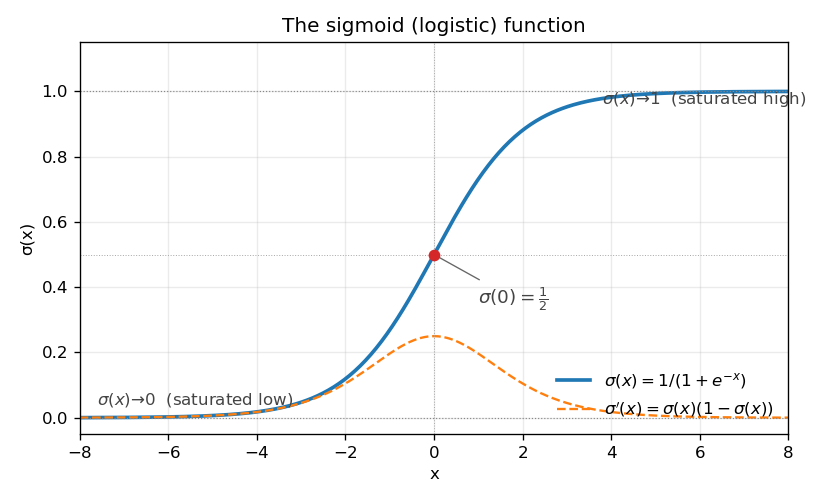

# Sigmoid Function

## Bridges from

- **A dimmer switch.** A binary on/off switch is a step function — flip
  it and the light is either fully off or fully on, nothing in between.
  A dimmer switch is a *smoothed* version: turn the dial and the
  brightness rises gradually from "essentially off" through a sensitive
  middle range, then settles at "essentially fully on." The sigmoid is
  the math version of that dial — a smooth, monotonic, $S$-shaped
  squash from 0 to 1.

  *Where the analogy breaks down:* a real dimmer's response is linear
  over most of its range (light intensity is roughly proportional to
  dial angle), while the sigmoid is **steepest in the middle and
  saturates at the ends** — equal twists of the dial near the middle
  change the output much more than equal twists near the extremes.
  That asymmetric sensitivity is the whole reason sigmoids work as
  probability squashers and the same reason they cause **vanishing
  gradients** when stacked deep: the derivative collapses to zero at
  both ends.

## Definition

$$
\sigma(x) \;=\; \frac{1}{1 + e^{-x}}, \qquad x \in \mathbb{R}.
$$

Also called the **logistic function**. Maps $\mathbb{R} \to (0, 1)$,
strictly monotonically increasing, with:

$$
\sigma(0) = \tfrac{1}{2}, \qquad
\lim_{x \to -\infty} \sigma(x) = 0, \qquad
\lim_{x \to +\infty} \sigma(x) = 1.
$$

Its derivative has a uniquely clean closed form:

$$
\sigma'(x) \;=\; \sigma(x)\,\bigl(1 - \sigma(x)\bigr),
$$

which is what makes sigmoid analytically convenient — once you've
computed $\sigma(x)$ you've already paid for $\sigma'(x)$.

## Why it shows up

Three independent reasons the same shape keeps appearing:

1. **Squash $\mathbb{R}$ to a probability.** The output is in $(0, 1)$,
   so it can be read as $P(\text{class} = 1 \mid x)$ in logistic
   regression and the final layer of binary classifiers.
2. **Smooth approximation to a step function.** Useful anywhere you
   want a differentiable "if $x > 0$" indicator (loss surfaces,
   attention masks, gating in classical RNNs / LSTMs / GRUs).
3. **Symmetric saturation.** The function and its derivative are
   reflection-symmetric around $x=0$ and $\sigma=\tfrac{1}{2}$:
   $\sigma(-x) = 1 - \sigma(x)$. This is why it's the natural
   activation for problems with a meaningful "positive vs. negative"
   axis.

## Key facts in one place

| Property                | Value                                    |
| ----------------------- | ---------------------------------------- |
| Range                   | $(0, 1)$                                 |
| Midpoint                | $\sigma(0) = \tfrac{1}{2}$               |
| Asymptotes              | $0$ as $x \to -\infty$; $1$ as $x \to +\infty$ |
| Symmetry                | $\sigma(-x) = 1 - \sigma(x)$             |
| Derivative              | $\sigma(x)\,(1 - \sigma(x))$, max $= \tfrac{1}{4}$ at $x=0$ |
| Inverse (logit)         | $\sigma^{-1}(p) = \log\!\frac{p}{1-p}$   |
| Relation to $\tanh$     | $\sigma(x) = \tfrac{1}{2}\bigl(1 + \tanh(x/2)\bigr)$ |

## Practical pitfalls (what to actually watch for)

- **Vanishing gradients.** $\sigma'(x) \le \tfrac{1}{4}$ everywhere, and
  $\sigma'(\pm 6) \approx 0.0025$. Stacking many sigmoid layers
  multiplies these together — gradients shrink exponentially in
  network depth. This is the reason modern deep nets prefer ReLU
  family activations in hidden layers and reserve sigmoid for output
  layers where saturation is desirable.
- **Numerical overflow at large negative $x$.** Naively computing
  $1/(1+\exp(-x))$ overflows for very negative $x$. Use the equivalent
  form $\sigma(x) = \exp(x)/(1 + \exp(x))$ when $x < 0$, or just
  `scipy.special.expit` / `torch.sigmoid` which handle this.
- **Output is not zero-centered.** Sigmoid outputs are always positive,
  which biases gradient updates in the next layer in a consistent
  direction. $\tanh$ doesn't have this issue.
- **Log-space arithmetic.** In classification losses, prefer
  `binary_cross_entropy_with_logits` (PyTorch) over
  `sigmoid → binary_cross_entropy`; the combined version is more
  numerically stable.

## In imitation learning / VLA models

Sigmoid shows up sparingly in modern policy networks:

- Final-layer activation when an output should be interpreted as a
  probability or gripper state ("open" / "closed" can be modeled as a
  sigmoid).
- Inside attention or gating modules in some transformer variants,
  though softmax dominates here.
- Generally **not** an activation choice in the hidden layers of
  policies like [[Action Chunking Transformer]] or modern diffusion
  policies — those use ReLU / GELU / SiLU. Sigmoid's role is at
  *input/output boundaries*, where its saturation is a feature.

## Variations / debates

- **Sigmoid vs. softmax** for multi-class output: softmax couples class
  probabilities (they sum to 1); independent sigmoids do not — use
  sigmoid per class for multi-*label* problems where multiple classes
  can be active at once.
- **Sigmoid vs. $\tanh$**: same shape, different range ($(-1, 1)$ vs.
  $(0, 1)$). $\tanh$ is zero-centered which helps optimization
  dynamics; sigmoid is interpretable as a probability.
- **"Sigmoid" the family vs. the logistic.** "Sigmoid" sometimes refers
  to any $S$-shaped function (logistic, $\tanh$, hard-sigmoid,
  Gompertz, error function). In ML practice "sigmoid" almost always
  means the specific logistic $1/(1+e^{-x})$ unless qualified.

## Related concepts

- [[Action Chunking Transformer]] — uses other activations; sigmoid is
  context for understanding why.
- [[Imitation Learning]] — sigmoid output for binary action heads
  (e.g., gripper open/closed).
- (red link) [[Softmax]] — multi-class generalization, with the
  coupled-probabilities trade-off.
- (red link) [[Cross-Entropy Loss]] — pairs with sigmoid in the
  numerically-stable `BCEWithLogits` formulation.

## Mentions

- (none yet — first appearance in the wiki)
