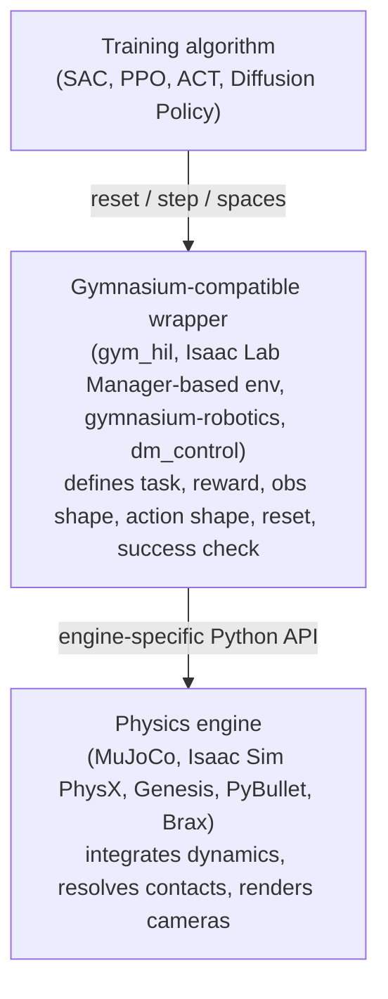
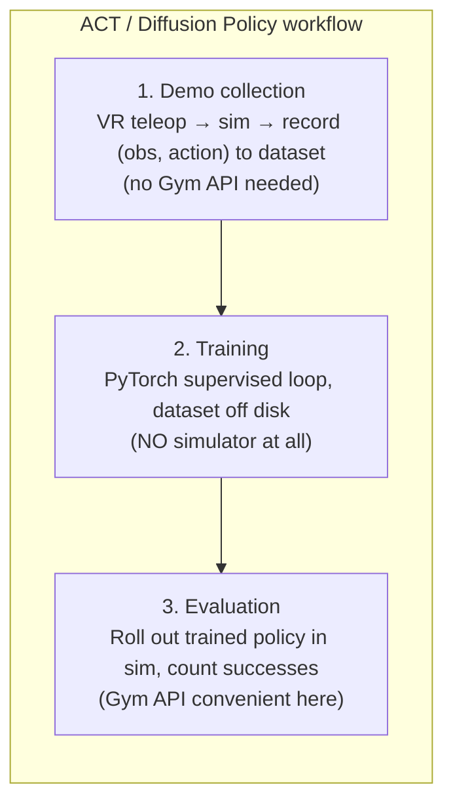

# Training Environments and the Gymnasium API

> The Gymnasium API is a *contract* about how a training algorithm and a simulated world talk to each other. The simulator that lives behind that contract — MuJoCo, Isaac Sim, Genesis, PyBullet, even a real robot — is a separate concern. This page disentangles the two and shows when each matters in practice for both reinforcement learning and imitation learning workflows.

## Bridges from

- **Power outlets and appliances.** The wall socket in your house is a *standard*: three holes, fixed voltage, fixed frequency. Anything that fits the plug — a toaster, a TV, a phone charger — can run off it. The socket doesn't *do* anything; it just provides a contract: "fit me, and you get power." The appliance is what actually does the work. **Gymnasium is the socket; the physics simulator is the appliance.**

  *Where the analogy breaks down:* a wall socket is fully opaque — your toaster has no idea what's generating the electricity. But the physics engine inside a Gymnasium env still **matters for fidelity, speed, and what sensors are available**. The wrapper hides the API surface, not the physics quality. You can swap MuJoCo for Isaac Sim behind the same Gymnasium env, but a policy trained against one will behave differently on the other because the contacts, friction, and sensors aren't identical. *The interface is portable; the simulation isn't.*

## Definition

**Gymnasium** (formerly OpenAI Gym, now maintained by the Farama Foundation) is a Python API standard. An environment that "is Gymnasium-compatible" exposes:

| Member | Purpose |
|---|---|
| `reset() → (obs, info)` | Put the world back to an initial state, return first observation |
| `step(action) → (obs, reward, terminated, truncated, info)` | Advance the world by one tick under the agent's action |
| `observation_space` | Shape, type, and bounds of observations (a `gym.spaces.*` object) |
| `action_space` | Shape, type, and bounds of allowed actions |
| `render()` *(optional)* | Produce a human-viewable frame |
| `close()` *(optional)* | Release simulator resources |

That's it. No physics, no rendering, no robot is required by the spec — only this five-method contract. An Atari emulator can be a Gymnasium env. A chess engine can be a Gymnasium env. A real LeRobot SO-101 arm can be a Gymnasium env. **The contract is silent on what lives behind it.**

## The two layers

A robot RL/IL training stack has these layers, in increasing abstraction:

- **Top (training algorithm)** speaks Gymnasium. It calls `reset()`, calls `step(action)`, reads `obs/reward/done`. It doesn't know what's underneath.
- **Middle (the wrapper)** is a few hundred lines of Python that load an asset (MJCF, URDF, USD), define what counts as one *control step* (often N physics substeps), compute a `reward` from world state, and expose the Gymnasium five-method surface.
- **Bottom (the physics engine)** does the actual numerical work — integrating equations of motion, resolving contact constraints, advancing time.

**The same physics engine appears under many wrappers.** MuJoCo sits under `dm_control`, `gymnasium-robotics`, `MuJoCo Playground`, and `gym_hil` — each with different tasks, rewards, and observation choices. Isaac Sim sits under Isaac Lab's Manager-based env classes, plus countless custom wrappers. Same kitchen, different menus.

### Concrete example: gym_hil

The LeRobot tutorial "[Train RL in Simulation](https://huggingface.co/docs/lerobot/hilserl_sim)" uses `gym_hil`, which is a thin Gymnasium wrapper around **MuJoCo** simulating a Franka Panda picking a cube. The three published tasks (`PandaPickCubeBase-v0`, `PandaPickCubeGamepad-v0`, `PandaPickCubeKeyboard-v0`) all share the same MuJoCo physics underneath; the variants differ only in how the *human intervention* channel is hooked up (gamepad vs. keyboard). The tutorial teaches **HIL-SERL** — Human-in-the-Loop Sample-Efficient RL — a specific online RL algorithm with human corrections from [Luo et al. 2024](https://arxiv.org/abs/2410.21845).

## What the API standardizes — and what it doesn't

This matters for reading other people's training code without surprise.

What `gym.make("HumanoidFlat-v5")` **does** tell you:
- There's a registered env behind that string.
- It will respond to `reset()` and `step()`.
- It exposes `observation_space` and `action_space` you can introspect.

What that same line **does not** tell you:
- Which **physics engine** is behind it (MuJoCo? Brax? Isaac? a chess board?).
- What an **observation** actually is — joint positions only? Joint velocities? Cameras? IMU? Tactile?
- What an **action** actually is — torques? Target positions? End-effector deltas? Discrete buttons?
- What the **reward function** measures — forward velocity? Energy efficiency? Sparse success bit?
- The **control frequency** the env runs at.
- What "**Flat**" means — terrain type? Reward shaping?
- When an episode **terminates vs. truncates**.

You have to open the env class to find out. The API is deliberately silent on semantics; it just standardizes the conversation shape so RL algorithms can be drop-in across environments. This is both the strength (portability) and the weakness (zero self-documentation) of the standard.

## When a Gym env is useful — RL vs. IL

The Gymnasium API was designed for **reinforcement learning**, where an agent generates experience by interacting with an environment. It fits IL less naturally. Here's the breakdown for the two paradigms.

### Reinforcement learning (e.g., HIL-SERL, SAC, PPO)

| Stage | Need a simulator? | Need the Gymnasium API? |
|---|---|---|
| Collection | n/a — generated on-the-fly by training | n/a |
| **Training** | **Yes** — actor calls `step()` continuously | **Yes** — that's the contract the training algorithm speaks |
| Evaluation | Yes | Yes |

RL needs an **interactive loop**: the policy picks an action, the env returns a new observation and a reward, the policy updates, repeat. The Gymnasium contract is precisely this loop. RL training is *inseparable from the env*.

### Imitation learning (e.g., ACT, Diffusion Policy)

| Stage | Need a simulator? | Need the Gymnasium API? |
|---|---|---|
| **Collection (teleop demos)** | **Yes** — to produce realistic (obs, action) pairs | Often **no** — teleop bypasses the Gym wrapper |
| **Training** | **No** | **No** — pure PyTorch supervised loop |
| **Evaluation (rollout)** | **Yes** | **Yes** — clean `reset()` + `step()` is exactly what you want |

Two corrections to watch for when reasoning about this:

1. **Rewards are irrelevant for IL.** ACT and DP consume only `(observation, action)` pairs from a dataset. Even if you used a Gym env for demo collection, the `reward` channel would be discarded — IL has no notion of "score." The teacher's demonstrated action *is* the supervision.

2. **Teleop pipelines usually bypass the Gymnasium API.** A teleoperator's intent flows continuously at human-natural rates (cameras 30 Hz, physics 60–120 Hz, hand motion smooth). The Gymnasium contract — "policy emits one action per `step()`, env replies once" — is built around an *agent* deciding, not a *human* moving fluidly. [[VR Teleoperation in Simulation]] pipelines like LeIsaac read and write Isaac Sim state directly and write LeRobot-format datasets, with no Gymnasium env in the loop. The simulator is still doing all the physics; it's just not wearing the Gym hat during collection.

Step 2 is the cleanest way to see the IL/RL distinction: **RL training is interactive; IL training is just data + loss.**

## Why ACT needs no reward function — the deep distinction

| Paradigm | Supervision signal | Who designs it |
|---|---|---|
| **Reinforcement Learning** | A scalar **reward function** $r(s, a)$ defined over states and actions | A human, often painfully (reward shaping is hard) |
| **Imitation Learning** | The teacher's **demonstrated actions** at each observed state | The teacher's body, implicitly, via teleop |

RL says: *"Here is a reward; figure out what to do to maximize it."*
IL says: *"Here is what to do; learn to do it."*

That's why HIL-SERL needs a reward function ("did the cube get lifted?") and ACT does not. ACT learns the conditional distribution $p(\text{action} \mid \text{observation})$ exhibited by the teacher; it never needs anyone to write down a scoring rule. For fine-manipulation tasks where "good behavior" is approximately impossible to express as a clean reward (gentle placement, contact-rich assembly, dexterous grasping), this is a huge practical advantage of IL.

### Specifically, ACT's training signal

ACT predicts a **chunk** of $k$ future actions $(a_t, a_{t+1}, \ldots, a_{t+k})$ given the current observation $o_t$. The teacher dataset contains exactly those actions, recorded during teleop. The loss is:

$$
\mathcal{L}_{\text{ACT}}(o_t, \mathbf{a}_{t:t+k}) \;=\; \|\hat{\mathbf{a}}_{t:t+k} - \mathbf{a}_{t:t+k}\|_1 \;+\; \beta \, \mathrm{KL}\bigl(q_\phi(z \mid \text{demo}) \,\|\, \mathcal{N}(0, I)\bigr)
$$

— an L1 reconstruction loss on the action chunk, plus a small KL term regularizing the CVAE latent $z$ that captures demonstrator style. See [[Action Chunking Transformer]] for the full picture. Diffusion Policy uses a different loss family (score-matching / denoising on action sequences) but the same core supervision: predicted action vs. demonstrated action.

The comparison is **action vs. action**, not state-trajectory similarity — though intuitively, if every predicted chunk matches the teacher's chunk at the same observation, the resulting state trajectory will match too.

### The flip side: distribution shift

Because the IL policy only ever sees the *demonstrated* state distribution, it has no training signal for *recovery* if it drifts off-distribution at deployment. A 1% per-step error compounds catastrophically over a long horizon. ACT's two mitigations — **action chunking** (predict $k$ steps ahead → fewer independent decisions) and **temporal ensembling** (average overlapping predictions for smoothness) — exist for this exact reason. [[Imitation Learning]] frames the same problem from the policy-learning side.

This is also precisely why HIL-SERL exists: human-in-the-loop interventions inject corrective data at the off-distribution states where a pure IL policy would fail. The two paradigms can be combined — IL pretrains the policy, then RL with human interventions fine-tunes it through the failure modes IL alone can't cover. The trade-offs (DAgger-style "stay in IL" vs. HIL-SERL-style "switch to RL"), plus the architectural friction that ACT and Diffusion Policy specifically have with RL fine-tuning, are covered in [[Imitation Learning#Correcting an IL policy with human interventions]].

## Practical mapping for the LeIsaac onramp

Anchoring this to the active project:

- **LeIsaac is an IL pipeline.** Demo collection via VR teleop → Isaac Sim → LeRobot dataset → train ACT/DP offline → roll out in sim. No Gymnasium env in the training loop.
- **Isaac Lab does ship Gymnasium-compatible envs** (Manager-based and Direct env classes). They become relevant if/when you want to *also* try RL training in the same simulator, or use the same env class for clean policy *evaluation*.
- **The `gym_hil` tutorial is a different track** from LeIsaac — same MuJoCo-vs-Isaac aside, the bigger gap is RL-vs-IL. It's worth knowing it exists if RL fine-tuning ever becomes interesting, but it's not on the critical path for "collect VR demos and train a small ACT policy."

## Common Gymnasium-compatible environments in robotics

| Wrapper | Physics engine | Typical use |
|---|---|---|
| `gym_hil` | MuJoCo | LeRobot HIL-SERL tutorial; Franka pick-cube |
| `gymnasium-robotics` | MuJoCo | Fetch, ShadowHand, AntMaze benchmarks |
| `dm_control` | MuJoCo | DeepMind's locomotion / manipulation suite |
| `MuJoCo Playground` | MuJoCo (MJX) | GPU-batched RL benchmarks |
| Isaac Lab envs | Isaac Sim PhysX | Domain randomized, GPU-parallel RL training |
| `ManiSkill3` | SAPIEN | Manipulation benchmark suite, GPU-parallel |
| `gym-pybullet-drones` | PyBullet | Multi-drone RL |

Genesis (see `raw/genesis-world-research-snapshot.md`) doesn't ship first-party Gymnasium envs for every task — you'd write a thin wrapper if you wanted to slot a Genesis scene into an RL training pipeline.

## Connections

- [[Isaac Lab]] — concrete Gymnasium-compatible wrapper around Isaac Sim with manager-based env composition.
- [[VR Teleoperation in Simulation]] — the demo-collection pattern that intentionally bypasses the Gymnasium API.
- [[Action Chunking Transformer]] — IL training, no env needed during training.
- [[Imitation Learning]] — paradigm-level overview; this page is the API-layer companion.
- [[Robot Learning]] — superset that contains both IL and RL.

## Sources

- LeRobot tutorial: "Train RL in Simulation" (`huggingface.co/docs/lerobot/hilserl_sim`).
- `gym_hil` repository (`github.com/huggingface/gym-hil`).
- Gymnasium project (Farama Foundation): `gymnasium.farama.org`.
- Luo et al., *Precise and Dexterous Robotic Manipulation via Human-in-the-Loop Reinforcement Learning*, arXiv:2410.21845 (HIL-SERL paper cited by the LeRobot tutorial).
- ACT / ALOHA paper (Zhao et al., 2023) — see [[Learning Fine-Grained Bimanual Manipulation with Low-Cost Hardware - Zhao et al]].
