# VR Teleoperation in Simulation

> Using a VR headset to drive a simulated robot in real time, capturing the demonstrations into a dataset format suitable for imitation-learning policy training. Alternative to gamepad/keyboard teleop and to physical leader-arm rigs. Where the [[Robotics Development Stack]] "Data" layer meets the "Simulation" layer.

## Everyday analogy: puppeteer running a marionette over a video call

You're a puppeteer holding two invisible handles in the air. A marionette sits on a stage on another planet, and you're driving it by video call. Each layer of the VR-teleop stack solves *one specific gap* between *your hands in your room* and *the puppet on the stage*:

| Gap | Layer that closes it |
|---|---|
| "Where are your hands right now?" | Headset SDK / **OpenXR** — captures hand pose (6-DoF wrist + finger joints) |
| "Get that across to the stage" | Streaming layer — **CloudXR**, WebSocket, ZMQ, or UDP |
| "Your room's 'up' isn't the stage's 'up'" | **Coordinate-frame transform** (Y-up VR ↔ Z-up robot) |
| "Your arm reach ≠ the marionette's" | **Retargeting** — scale and remap human pose to robot end-effector target |
| "What joint angles make the puppet's hand go there?" | **Inverse kinematics** |
| "The marionette lives in a physics-simulated room" | **Physics engine** — PhysX (Isaac Sim) or MuJoCo |
| "Record the show so I can study it later" | **Dataset writer** (LeRobot schema → Parquet on disk) |

**Where the analogy breaks down**: a real puppeteer feels rope tension — they know when the puppet bumps something. In VR teleop you get **no force feedback** unless you wire up haptics explicitly, so contact-rich tasks (insertion, dragging, anything requiring "press until you feel it") are harder to demonstrate well than they look. This is one of the genuine disadvantages of VR teleop versus a physical leader-arm rig where the leader's joints get back-driven by the follower's contact.

## The end-to-end data flow

```mermaid
flowchart LR
    HMD[VR Headset<br/>Quest 3 / Pico 4 Ultra]
    SDK[Headset SDK<br/>OpenXR hand & controller pose]
    NET[Streaming<br/>CloudXR / WebSocket / ZMQ]
    XFM[Frame Transform<br/>Y-up VR -> Z-up robot]
    RT[Retargeter<br/>human pose -> EE target SE_3]
    IK[Inverse Kinematics<br/>EE target -> joint angles]
    SIM[Physics Sim<br/>Isaac Sim PhysX / MuJoCo]
    CAM[Sim cameras<br/>RGB / depth tensors]
    DS[Dataset Writer<br/>LeRobot Parquet schema]
    POL[Policy Training<br/>ACT / Diffusion Policy / VLA]

    HMD --> SDK --> NET --> XFM --> RT --> IK --> SIM
    SIM --> CAM --> DS
    IK --> DS
    DS --> POL
```

Every link in this chain is a place an existing tool can give you a batteries-included implementation — or where you can scaffold your own for learning. That choice is the next section.

## Why LeIsaac? Or: should I scaffold from scratch?

**[LeIsaac](https://github.com/lightwheelai/leisaac)** is a teleop framework that sits on top of NVIDIA's **[IsaacLab](https://isaac-sim.github.io/IsaacLab/)**, which in turn sits on top of **Isaac Sim**. It was originally built for the **SO101Leader** physical leader arm (the LeRobot project's low-cost teleop arm), and it inherits IsaacLab's **OpenXR / CloudXR** path so a VR headset can also drive the simulated robot. It exports demonstrations directly into the **LeRobot dataset format**, which is what [[Action Chunking Transformer]] and Diffusion Policy training pipelines consume.

The honest framing: LeIsaac doesn't *implement* the VR-to-sim plumbing — **IsaacLab does**. LeIsaac's value-add is the LeRobot-shaped integration: the SO101Leader interface, episode recording in the LeRobot schema, dataset conversion utilities, and example tasks. So "should I use LeIsaac" decomposes into three sub-decisions, one per replaceable layer:

| Layer | "Use the stack" answer | "Scaffold from scratch" answer |
|---|---|---|
| **Sim + physics + sensors** | Isaac Sim / IsaacLab (GPU PhysX, USD scenes, photoreal cameras) — or MuJoCo for lighter-weight | Hard to replace. Writing your own physics is a 6-month project that teaches you physics, not robotics. |
| **VR ↔ sim bridge** (pose streaming, frame transform, retargeting, IK) | IsaacLab's `OpenXRDevice` + `Retargeter` + CloudXR | **This is where the learning lives.** Reasonable to roll your own: OpenXR or vendor SDK → WebSocket → Python script doing the math. |
| **Dataset writer + LeRobot integration** | LeIsaac's recorder | Trivial to roll your own: LeRobot's dataset API is a few hundred lines to call directly. |

So the answer depends on the goal:

- **Goal: get demos collected, train a policy, move on.** Use LeIsaac. It collapses the stack into a working pipeline in a day, and the things it abstracts (CloudXR setup, USD scenes, dataset schema) are configuration details, not insights.
- **Goal: learn the stack itself.** Build the **middle layer** from scratch on top of an existing sim. Use Isaac Sim (or MuJoCo for lower setup cost) as your physics layer; write your own pose stream → frame transform → retargeter → IK → action loop in Python. This is where you'll actually internalize SE(3), quaternions, retargeting, and controller design. The dataset writer at the end you can swap in LeRobot's API once the loop is closed.

For *your* current trajectory (mid-flight on Modern Robotics Ch. 3 — $SO(3)$, $SE(3)$, twists, exponential coordinates), the scaffold-from-scratch middle layer is genuinely high-leverage learning. Every transformation that LeIsaac hides is a thing you'll be solving by hand in Ch. 3–6 of the textbook anyway. The "lazy" path is also the "ship faster" path, which is the right call when ready to actually train a policy — but is weak as a learning vehicle.

A reasonable hybrid: scaffold the bridge yourself first; once it works, diff your code against LeIsaac's to see what production code looks like.

## Prerequisites

### Hardware

- **VR headset with hand tracking and 6-DoF controllers.** In rough order of how often they appear in public LeRobot-adjacent projects:
  - **Meta Quest 3 / 3S** — most common, well-supported via OpenXR, hand tracking is solid. The 3S is the cheaper option.
  - **Pico 4 Ultra** — used by several Chinese-developed teleop projects; Pico Motion Tracker integration available.
  - **Apple Vision Pro** — supported by IsaacLab's CloudXR path; gives you 26 keypoints per hand for dex-retargeting; cost rules it out for most learners.
- **GPU**: NVIDIA RTX 30-series or newer for Isaac Sim (40-series comfortable). MuJoCo runs on CPU and works on any modern laptop — this is the cheap path if you don't have a strong GPU. Isaac Sim is effectively NVIDIA-only.
- **RAM**: 32 GB comfortable for Isaac Sim; 16 GB enough for MuJoCo.
- **Networking**: PC and headset on the same Wi-Fi (Wi-Fi 6 helps with latency; CloudXR is bandwidth-hungry). Wired link via USB-C + Quest Link / Virtual Desktop is also fine.
- **Optional but useful**: a desk-mounted external camera so you can see yourself in VR (helpful for adjusting workspace anchor position).

### Software / OS

- **Linux (Ubuntu 22.04)** is the path of least resistance for Isaac Sim. Windows works for some configurations; macOS does not for Isaac Sim but does for MuJoCo.
- Python 3.10 / 3.11, PyTorch with CUDA build matching your driver, conda for environment isolation.

### Skills you'll lean on

| Skill | Where in the stack | Your current state |
|---|---|---|
| Python + numpy fluency | All layers | Solid |
| Linux / shell / git | Setup, environments | Solid |
| **Rigid-body transforms ($SE(3)$, $SO(3)$)** | Frame transform + retargeter | **Active gap — Ch. 3 next** |
| **Quaternions + SLERP** | Smooth orientation interpolation | Active gap |
| **Inverse kinematics** (analytic + Jacobian-based) | IK layer | Active gap — Ch. 6 of Modern Robotics |
| Networking (WebSocket / ZMQ / UDP) | Streaming layer | Likely solid from automation background |
| Real-time / latency budgeting | All layers | **Solid — direct transfer from automation** |
| USD / scene description (Isaac Sim only) | Sim layer | New, but configurational not conceptual |
| PyTorch + dataset loading | Training layer | Active gap — comes after demos exist |
| **No prior VR development experience required** if you use OpenXR + existing SDKs | Headset SDK | n/a |

The automation-engineer background is a genuine advantage in two places: **latency analysis** (you've already thought hard about jitter, deterministic loops, and worst-case timing), and **safety/limits** (workspace bounds, soft limits, e-stops translate directly into the teleop loop's safety layer).

## Core underlying technologies

### 1. OpenXR — the headset abstraction

OpenXR is the Khronos cross-vendor standard for getting headset data into application code. It exposes the headset's tracked poses (head, controllers, hands) as 6-DoF transforms in a stable reference frame. Using OpenXR rather than the vendor SDK directly means your teleop code runs against Quest, Pico, Vision Pro, and Index without per-vendor forks.

In IsaacLab this is wrapped as [`isaaclab.devices.OpenXRDevice`](https://isaac-sim.github.io/IsaacLab/main/source/how-to/cloudxr_teleoperation.html); each frame it yields the latest hand poses, which feed the retargeter.

### 2. CloudXR — the streaming layer for headset → PC

If your headset is *not* tethered to the workstation running Isaac Sim (common: Quest is wireless), you need a bridge that streams the headset's tracking data to the PC in real time. **NVIDIA CloudXR** is what Isaac Sim uses out of the box; it gives you sub-frame latency at the cost of CloudXR-the-network-protocol on top of your Wi-Fi.

For a from-scratch stack the moral equivalent is **WebSocket** or **ZMQ** publishing a `{timestamp, head_pose, hand_pose_left, hand_pose_right, fingers, buttons}` payload at 60–120 Hz. LeIsaac itself uses ZMQ for its remote-teleop mode, which is a reasonable reference implementation.

### 3. Coordinate-frame conversion (Y-up VR ↔ Z-up robot)

VR SDKs use Y-up, right-handed (or left-handed, varies by vendor). Robotics convention is Z-up, right-handed. A constant rotation matrix $R_{VR \to robot}$ converts between them. You also need a *workspace anchor*: a transform that says "the origin of the robot's task frame corresponds to this pose in the headset frame," so the user can re-zero their hands.

This is exactly the $SE(3)$ machinery from Modern Robotics Ch. 3 — when you study it, "transforming a pose between two frames" stops being abstract and becomes "the thing that makes my hand correspond to the robot's gripper." Hold on to that motivation; it makes the chapter feel useful instead of formal.

### 4. Retargeting — human pose → robot EE target

A 7-DoF anthropomorphic arm is the easy case: you map "where the user's hand is" to "where the robot's end-effector should be" with a scale factor and the frame transform above. BEAVR's recipe (one of the cleaner published ones) uses **Gram-Schmidt orthogonalization** on multiple hand landmarks to build a stable hand frame, then maps that frame onto the EE target. For dexterous hands the problem gets harder (you have a 26-keypoint human hand and a 5-finger robot hand with different bone lengths) — this is the "dex-retargeting" or "DexPilot" literature, and you'd reach for an optimizer like [`dex-retargeting`](https://github.com/dexsuite/dex-retargeting).

### 5. Inverse kinematics — EE target → joint angles

Given a desired end-effector pose $T_{ee}^{desired} \in SE(3)$, find joint angles $q$ such that the forward kinematics map $f(q) = T_{ee}$. Three flavors you'll encounter:

- **Analytic IK**: closed-form, fast, works for arms with classical geometry (e.g., spherical wrist). Modern Robotics Ch. 6.
- **Numerical IK (Jacobian-based)**: damped least squares (DLS) using the [[Moore-Penrose Pseudoinverse]] of the Jacobian. General-purpose. This is where your pseudoinverse work pays off.
- **GPU IK** (e.g., NVIDIA's [cuRobo](https://curobo.org/)): batched, collision-aware, optimization-based; needed if you want to solve hundreds of IK problems per simulation step for parallel envs.

For VR teleop at 60–120 Hz on one arm, DLS in Python is plenty.

### 6. Smoothing — temporal filtering + SLERP

Headset tracking has noise. Raw poses fed to IK produce jerky robot motion. Standard recipe: moving average on the translation, **spherical linear interpolation (SLERP)** on the orientation quaternion, plus a complementary blend between new measurements and the previous frame's output. BEAVR documents exactly this combination as part of why their end-to-end latency stays under 35 ms.

### 7. Physics simulation — Isaac Sim vs. MuJoCo

- **Isaac Sim / IsaacLab**: GPU PhysX, photoreal cameras (RTX), parallel environments, USD scenes. Heavy install, NVIDIA-only, best-in-class sim-to-real visuals for vision policies.
- **MuJoCo**: CPU physics, fast and stable contact, easier to script, lighter-weight. Visual fidelity is lower — usable for proprioceptive policies but you'll want domain randomization or a second sim for vision policies.

For learning the *teleop* loop, MuJoCo is the faster on-ramp. For training image-conditioned policies that transfer to a real robot, Isaac Sim's renderer pays off.

### 8. LeRobot dataset schema

The thing that makes a recorded episode useful for training is the schema. [LeRobot's dataset format](https://huggingface.co/docs/lerobot) is Parquet-backed, episode-indexed, with explicit fields for observation tensors (images, state) and actions, plus metadata for camera intrinsics, action spaces, FPS, and task descriptions. Conforming to it means your demos drop straight into ACT / Diffusion Policy / SmolVLA training loops with no glue code.

## How this connects back

- **Modern Robotics Ch. 3** ($SE(3)$, twists, exponential coordinates): this is the math behind the *coordinate-frame conversion* and *retargeting* layers. The Y-up-to-Z-up rotation, the workspace anchor, the hand-frame construction — all $SE(3)$ operations.
- **Modern Robotics Ch. 5–6** (Jacobians, IK): the IK layer is literally the application of Ch. 6, and DLS uses the [[Moore-Penrose Pseudoinverse]] you've already touched.
- **[[Action Chunking Transformer]] / Diffusion Policy**: these are trained on the datasets a VR teleop pipeline produces. Knowing the data path makes the policy paper readable as "this network consumes what I just recorded," not as an abstract benchmark.
- **[[Imitation Learning]]**: VR teleop is one of the primary data sources. Demo quality determines policy quality — which is why the "no force feedback" caveat above matters in practice.

## Open projects worth looking at

- **[LeIsaac](https://github.com/lightwheelai/leisaac)** — LeRobot-shaped teleop on IsaacLab; SO101Leader + VR; LeRobot dataset export.
- **[BEAVR](https://github.com/ARCLab-MIT/beavr-bot)** — bimanual, multi-embodiment VR teleop with LeRobot schema export; clean reference for retargeting + smoothing math; Quest 3S.
- **[IsaacLab CloudXR teleop docs](https://isaac-sim.github.io/IsaacLab/main/source/how-to/cloudxr_teleoperation.html)** — authoritative source for the OpenXRDevice + Retargeter API.
- **[lerobot_ur_dual_vrteleop](https://github.com/scy-v/lerobot_ur_dual_vrteleop)** — UR5/7e dual-arm VR teleop on top of LeRobot + Pico 4 Ultra; useful if you want a smaller from-scratch reference than BEAVR.
- **[XLeRobot teleop docs](https://xlerobot.readthedocs.io/en/latest/software/getting_started/XLeRobot_teleop.html)** — low-cost LeRobot-adjacent platform with multiple teleop modes.

## Related concepts

- [[Robotics Development Stack]] — where this pipeline sits in the bigger picture
- [[Imitation Learning]]
- [[Action Chunking Transformer]]
- [[Vision-Language-Action Models]]
- [[Moore-Penrose Pseudoinverse]] — the IK layer's workhorse
- [[Configuration Space]] — what the robot's joint vector lives in
- [[LeRobot]]

## Mentions

- [[Modern Robotics - Lynch & Park]] — Ch. 3, 5, 6 supply the underlying math
- [[LeRobot Documentation Index]]
